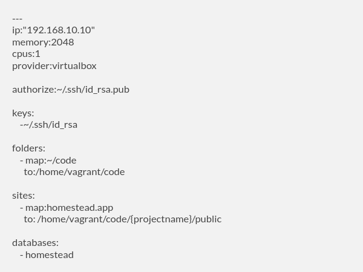
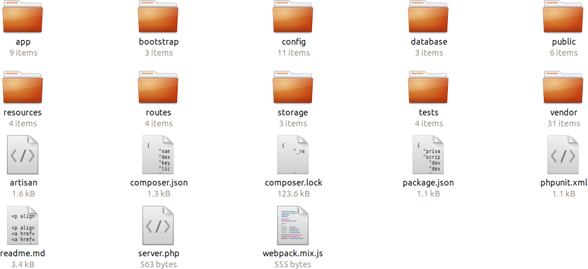

# Laravel with Homestead : Web app Development and Management

[PHP Docs](http://php.net/manual/en/)

[Laravel Docs](https://laravel.com/docs/5.5)


## What is Homestead

- Homestead is a pre-packaged vagrant box that provides you will all the development tools that you need by default

- Once you have setup your virtual machine and vagrant, you simply add homestead box to it and all of the development tools are installed automatically for you. This saves you the time of individually installing the required software.

- Laravel homestead isn’t limited to the Laravel framework.

- You can generally development any PHP web application using homestead.


## Advantages of Homestead

- Local development environment simulates production environment

- Needed software out of the box

- VM’s can be disposable and recreated within minutes without affecting application source code

- Easily share your vagrantfile with others


## Introduction to PHP and Laravel

PHP, very much like node.js or ruby is a back-end language. It is especially suited for web development.

Laravel is a front-end framework for PHP. 

Writing PHP and Laravel feels very similar to writing Ruby and Rails respectively. 


An example of this can be seen here when we make controllers for websites:


### Rails
```
class ForumsController < ApplicationController

  def index
    @forums = Forum.all
  end

end
```

### Laravel
```
<?php

class FarmController extends Controller{
  public function index(){
    $farms = Farm::all();
    return view('farms.index', ['farms' => $farms]);
  }
}

?>
```

## How to Setup and Install

- First we needs to install virtual box and vagrant:

  [Virtual Box](https://www.virtualbox.org/wiki/Downloads)

  and

  [Vagrant](https://www.vagrantup.com/downloads.html)


- Once these two are installed type the following in your terminal:

```
  vagrant box add laravel/homestead
  ```

- You will need to make a choice of what provider you want, enter 2 for virtualbox:


- Next type into your terminal:

```
git clone https://github.com/laravel/homestead.git Homestead
```

- To Initialize our homestead we need to cd into the homestead directory and type:

```
bash init.sh
```

- Create an ssh key if it doesn’t exist: 

```
ssh-keygen -t rsa -C “your_email@example.com”
```

- Open the homestead directory in your preferred text editor, change homestead.yaml to the following::

 

- In the terminal type:
```
    sudo nano /etc/hosts
```

  - At the end of the file add the following:
```
192.168.10.10 homestead.app
```
  - Press ctrl + X followed by Y and then enter to save your changes.


## Vagrant Global Aliases

```
# Some shortcuts for easier navigation & access
alias ..="cd ..";
alias vm="ssh vagrant@127.0.0.1 -p 2222";

# Homestead shortcut
function homestead() {
  ( cd ~/Homestead && vagrant $* )
} 
```

  - To up vagrant box use: homestead up

  - To stop vagrant box use: homestead halt

  - To log into vagrant box use: homestead ssh


## Creating Your First Project

- Homestead ssh

- Cd to shared folder ~/Code

- composer create-project --prefer-dist laravel/laravel Laravel

- Creates a default project in a directory called Laravel inside of the code folder

- Laravel uses a MVC architecture

- To view the created app load homestead.app in the browser, which has been linked to ```192.168.10.10``` in the host file


## Laravel File Structure





The important files created in the root are:

**artisan**: It is end point for artisan command which is used for various tasks and functions in Laravel.

**composer.json**: Dependency and all list for composer installation

**.env**: This file contain configuration based on the environment of the application.

**package.json**: This file contain node related dependency, for example compiling SASS or LESS.

Upon installing following directories will be created

- app
- bootstrap
- config
- database
- public
- resources
- routes
- storage
- tests
- vendor

#### App Directory

App Folder is one of major folder / directory in Laravel Framework, In Laravel Most of logics are written in App folder. This folder / directory contains below folders.

- Console
- Exceptions
- Http
    - Controllers
    - Middleware
- Providers

#### Bootstrap Directory

The bootstrap directory of Laravel contains files are used for bootstrapping and configuring Laravel Framework itself. This directory is also contains a cache directory which holds all framework generated files for performance optimization and

- bootstrap
    - cache

#### Config Directory

This directory contains all configration related files of laravel Framework. This directory consist of below files

- app.php
- auth.php
- broadcasting.php
- cache.php
- database.php
- filesystems.php
- mail.php
- queue.php
- services.php
- session.php
- view.php

#### Database Directory

Laravel’s Database Directory is used to kept your database migrations and seeds. If you are going to use SQLLITE Dtabase, then you can also use this directory to hold and SQLLITE DB.

#### Public Directory

The public directory of laravel consist of a file named index.php. In Laravel this file is an entry point for your application .This directory also holds your public assets like images , js , css files.

#### Resources Directory

Laravel’s Resources directory contains all view files of your application. This directory also hold your language files

#### Routes Directory

The routes directory of laravel contains all of the routes of your applications. web.php, api.php, console.php and channels.php are default routes files that are included in Laravel 5.4

- web.php: - This file contains all routes that RouteServiceProvider places in web middleware group which provides session state, CSRF protection, and cookie encryption.
- api.php: - This file contains all routes that RouteServiceProvider places in the api middleware group, which provides rate limiting.
- console.php: - In this file you may define all of your Closure based console commands.
- channels.php: - In file you may register all of the event broadcasting channels that your application supports

#### Storage Directory

The storage directory of laravel contains all of your coompiled blade files,sessions files, file caches, and other files generated by the framework.

The storage/app/public is available for storing user-generated files, such as profile image,product images etc

#### Tests Directory

The tests directory contains all of your automated tests

#### Vendor Directory

The vendor directory contains Composer dependencies related files of your application.
