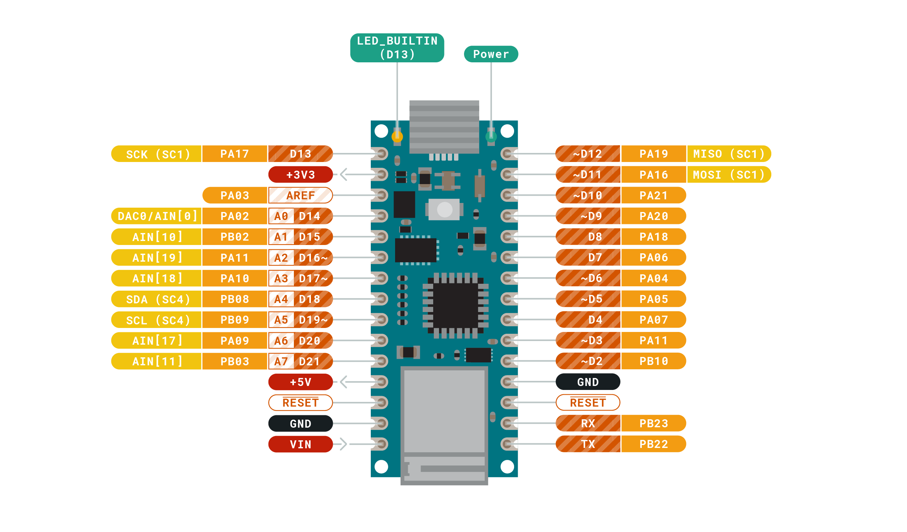
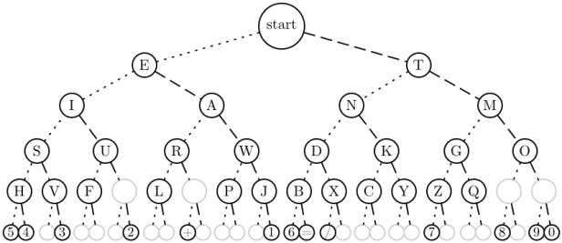

# UUG Arduino Demo - Morse Code

---

# Quick links if you're following along

- [Arduino Pin Out](Diagrams/Pinout-NANO33IoT_latest.png)
- [Wiring Schematic](Diagrams/schematics.png)
- [Morse Code](Diagrams/MorseCode.png)
- [Morse Code Tree](Diagrams/MorseCodeTree.jpg)

---

# Getting Started

- Split into 6 teams. Half of you will be sending code and the other half will receive the code but both sides will end up coding.

- Designate one person to assemble the Arduino and another person to install and run Arduino IDE

- If you are the person coding, go to <https://www.github.com/jmunixusers/presentations/tree/main/arduino>

---

# Setting up the Arduino IDE

- Go to <https://www.arduino.cc/en/main/software> and download the Arduino IDE.

- Once the IDE is downloaded, go to Tools > Board > Board Manager > Search "Nano 33" > Install `Arduino SAMD Boards (32-bits ARM Cortex-M0+)`

- Now go back to Tools > Board > Arduino SAMD Boards and select `Nano 33 IoT`

- When you plug in the board, make sure your port is Nano 33. Tools > Port.

---

# Installing Bluetooth Tools

- Go to Tools > Manage Libraries

- Search and install `ArduinoBLE`

---

# Building the Receiver Board

- You will be given a Arduino already connected to a breadboard, a wire, a 68 ohm resistor (brown), a LED, and a micro usb cord.

---


 1. Plug one end of resister into the D2 pin (row 20, column A on breadboard) and one end into row 10, column A, on breadboard.

 2. Plug the longer side of the LED into row 10, column B, next to the resistor.

 3. Plug the wire into row 9, column C, next to the LED and the other end into row 19 next the GND port (accented white on the actual Arduino).

---

# Building the Sender Board

- You will be given a Arduino already connected to a breadboard, two cables, a 10k ohm resistor (turquoise), a button, and a micro usb cord.

---

 

1. Plug the button into row 5 and 7 across the crease

2. Plug the resistor into row 19, column A, next the GND port (accented white on the actual Arduino) and row 5, column A

3. Plug one wire into row 21, column B and row 5, column B next to the resistor

4. On the opposite side, plug your 2nd wire into row 29, column J next to the +3V3 port and row 7, column J.

---

# Demo #1 - Turn LED On/Off (Receive teams)

Use the Test-LED example.

---

<!-- _color: black -->

```C

const int mypin = 2;

void setup() {
  pinMode(mypin, OUTPUT);
}

void loop() {
  digitalWrite(mypin, HIGH);   // turn the LED on (HIGH is the voltage level)
  delay(1000);                 // wait for a second
  digitalWrite(mypin, LOW);    // turn the LED off by making the voltage LOW
  delay(1000);                 // wait for a second
}

```

---

# Demo #2 - Turn the built-in LED On/Off using the button (Send Teams)

 Use the Test-Button example.

---

``` C

const int buttonPin = 3;

int buttonState = 0;

// the setup function runs once when you press reset or power the board
void setup() {
  // initialize digital pin LED_BUILTIN as an output.
  pinMode(LED_BUILTIN, OUTPUT);
  pinMode(buttonPin, INPUT);
}

// the loop function runs over and over again forever
void loop() {
  buttonState = digitalRead(buttonPin);

  // check if the pushbutton is pressed. If it is, the buttonState is HIGH:
  if (buttonState == HIGH) {
    // turn LED on:
    digitalWrite(LED_BUILTIN, HIGH);
    delay(1000);
    digitalWrite(LED_BUILTIN, LOW);
  }
}
```

---

# Demo 3 - Print "Short" and "Long" (Send Teams)

 Use the short_long_button_test example.

---

``` C

const int buttonPin = 3;

int buttonState = 0;

int count = 0;

// the setup function runs once when you press reset or power the board
void setup() {
  // initialize digital pin LED_BUILTIN as an output.
  pinMode(LED_BUILTIN, OUTPUT);
  pinMode(buttonPin, INPUT);
  Serial.begin(9600);
}

// the loop function runs over and over again forever
void loop() {
  buttonState = digitalRead(buttonPin);

  // check if the button is pressed. If it is, the buttonState is HIGH:
  if (buttonState == HIGH) {
    count++;
  }
    else {
      if (count > 25) {
        Serial.println("long");
      } else if (count > 1 && count < 25) {
        Serial.println("short");
      }
      count = 0;
    }
    delay(10);  
}

```

---

# Demo 4 - Doing Morse code (Both Teams)

There are two different examples. The send team will use `Bluetooth-Button` and the receive team will use `Bluetooth-LED`.

Go into the code and change `YOUR TEAM HERE` to a team name you share with your partners.

---

<!-- backgroundColor: white -->



