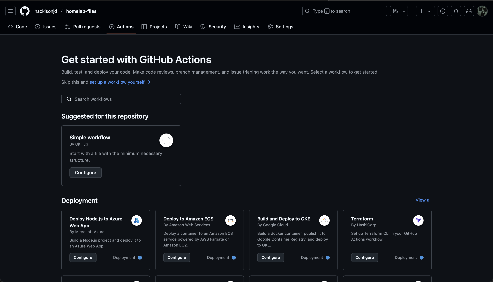

## What is CI/CD?

**Continuous Integration (CI)**: Automate the process of merging new code into a shared repository, early and often.

- Each commit triggers an automated workflow on a server that runs a series of tasks to ensure new code doesn't break the codebase.
- A natural evolution of test-driven development.

**Continuous Deployment/Delivery (CD)**: One step further than CI, code that passes all tests is automatically deployed to production, without manual intervention.

- Significantly harder to pull off, typically only used on basic, stateless systems.
  - Web servers and APIs, which are easy to rollback if something breaks
- The more complex and stateful the system is, the harder it is to make it truly rely on CD.

Most developer platforms have their own CI/CD solutions (GitHub Actions), but many people also self-host these solutions themselves (a topic for another time).

## The Theory

The idea is to automate the testing and delivery of software from the initial code commit all the way through to deployment.

### Why do this?

- Limits amount of human intervention required to build a project. (Automate once, be "lazy" forever)
- Allows for multiple people, with drastically different roles, to deploy code without conflicts ("merge hell")
- For large corporations, time is money!

**Is it worth it?** It depends!

## The Agenda

You will be setting up a sample GitHub repository, and setting up a GitHub Actions configuration file to ensure that code will be checked and, if it passes the tests, deploy a new build automatically.

**Terminology to understand:**

- **Events**: Trigger for a workflow. "When new code is pushed to this repository, run the below job."
- **Jobs**: A series of *steps* and *actions* that only run once triggered by an event (typically linters and testing software).
- **Runners**: An isolated environment (container) that runs our code throughout the CI/CD process.

Here is a simple example to demonstrate these concepts in action!

```yaml
# Make your names descriptive!
name: Lint

# Only run whenever new code is pushed to the repo
on: push

# Linting job
jobs:
  lint:
    name: Lint code base
    runs-on: ubuntu-latest # Define the OS for your runner.
    steps: # What the job will do, in order, once the event triggers
      - name: Checkout code
        uses: actions/checkout@v2

      - name: Run linter
        uses: github/super-linter@v3
        env: 
          DEFAULT_BRANCH: main # This job will ONLY run on the main branch
          # Never use plaintext to store sensitive information, use secrets!
          GITHUB_TOKEN: ${{ secrets.GITHUB_TOKEN }}
```

## Getting Started

*Note:* In order to follow along, you must install Git and have an active GitHub account.

### Fork my sample repository

For demonstration purposes, I have created a sample repository that contains a simple Python "Hello World" file.

1. Navigate to [the sample repository](https://github.com/hackisonjd/gh-actions-example).
2. In the top-right corner of the page, click **Fork**. Leave everything as default.
3. Click **Create fork**.

### Download the repository to your local device

1. On GitHub, navigate to **your fork** of the sample repository.
2. Above the list of files, click the green **Code** button
3. Copy the URL for the repository.
    1. If you have an SSH key associated with your GitHub account already, use the SSH option.
    2. Otherwise, use the HTTPS option.
4. Open your terminal, and type the following:

```bash
cd ~/Documents # Or use whatever directory you want!
git clone <PASTE YOUR LINK HERE>
```

After you've completed these steps, you should have the repository in the location you specified.

### Create your first workflow

```bash
cd gh-actions-example
mkdir .github/workflows && cd .github/workflows
touch static.yml
```

These commands do the following:

- Change to the `gh-actions-example` directory, where we downloaded our files from GitHub.
- Within that directory, make a directory named `workflows` that is inside another directory named `.github`, and change to that directory.
  - This directory is where GitHub looks for your workflow files.
- Create a new file named `static.yml`
  - This is your workflow file. It can be named anything you want, but make sure to leave the `.yml` extension!

### Open your workflow in a text editor

Let's say, for instance, we want our groundbreaking, revolutionary "Hello World" app to conform to standard PEP 8 formatting. How would we accomplish this?

```yml
name: Hello World application

on:
  push:
    branches: [ "main" ]
  pull_request:
    branches: [ "main" ]

jobs:
  build:

    runs-on: ubuntu-latest

    steps:
    - uses: actions/checkout@v4
    - name: Set up Python 3.10
      uses: actions/setup-python@v3
      with:
        python-version: "3.10"
    - name: Install dependencies
      run: |
        python -m pip install --upgrade pip
        pip install flake8 pytest
        if [ -f requirements.txt ]; then pip install -r requirements.txt; fi
    - name: Lint with flake8
      run: |
        # stop the build if there are Python syntax errors or undefined names
        flake8 . --count --select=E9,F63,F7,F82 --show-source --statistics
        # exit-zero treats all errors as warnings. The GitHub editor is 127 chars wide
        flake8 . --count --exit-zero --max-complexity=10 --max-line-length=127 --statistics
    - name: Test with pytest
      run: |
        pytest

```

### Time out! What's going on here?

This seems like a lot. What is this specifically doing?

- First, you're setting the *events* that will trigger this workflow. In this case, this workflow triggers when you push to the main branch of the repository, or if someone submits a pull request.
- Then, you're defining a job, and in that job, you're doing a couple of things:
  - First, you're saying that you want this *runner* to use Ubuntu.
  - Second, you're defining your *steps*:
    - Set up Python 3.10.
    - Install the dependencies we need.
    - Run the linter.
    - Run the tests.

Notice that these are things that you would ordinarily do manually (I hope) if you're deploying or pushing code to a repository.

By taking the extra five or so minutes to define a workflow first, you've saved yourself (or in an enterprise setting, your team) an insane amount of time in the future, especially as the project gets larger.

This is where CI/CD shines!

### Play around with the workflow

- Change specific arguments in the `.yaml` file. What's changed? How does this affect the testing behavior?
- Add a bunch of random whitespaces, or add some code that doesn't work. Does the integration fail?

## More Examples of CI/CD Pipelines

### Simple

- [Run python unit tests/codecov on multiple different python versions](https://github.com/TabulateJarl8/randfacts/blob/master/.github/workflows/main.yml)
- [Automatically build a jar in a Java Maven Project](https://github.com/TabulateJarl8/modpackSwitcher/blob/master/.github/workflows/main.yml)

### Complex

- [Build/deploy multiarch snaps, and other various Linux/Windows packages](https://gitlab.com/ImaginaryInfinity/squiid-calculator/squiid/-/blob/trunk/.gitlab-ci.yml)
  - [Full run view](https://gitlab.com/ImaginaryInfinity/squiid-calculator/squiid/-/pipelines/1711964739)
- [Build, test, and deploy multi-language bindings for many different platforms](https://gitlab.com/ImaginaryInfinity/squiid-calculator/squiid-bindings/-/blob/trunk/.gitlab-ci.yml?ref_type=heads)
  - [Full run view](https://gitlab.com/ImaginaryInfinity/squiid-calculator/squiid-bindings/-/pipelines/1712101626)
- [Huge GitLab Pipeline (click "Show dependencies")](https://gitlab.com/gitlab-org/gitlab/-/pipelines/1745834196)

## What's next?

This post is only really scratching the surface on what's possible with CI/CD, so here are some recommendations on
where to look to improve your knowledge.

- Take a look at some workflows on GitHub!
  - Here's [my workflow for Heehoposting](https://github.com/hackisonjd/heehoposting/blob/main/.github/workflows/hugo.yml).
- Evaluate some of the GitHub workflow templates and see if they work in your project.


