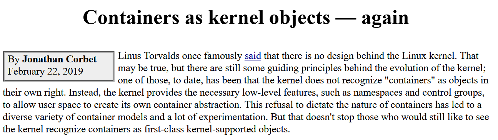

# Ripley's Thoughts on Containerization

And maybe some facts too

---
# Game plan

- This week: what is a Linux container and how do I build one?
- Next week: cool things with web apps, maybe even inside a container
- Next next week: running a cluster of apps on Kubernetes

---
# First things: what about Docker and why won't you say it?

We'll get to that later

---
# Ok, moving on...

---
# What is the right size of a computer?

- We spend a lot of time clustering servers together to solve big problems
- We spend even more time subdividing servers to work on a lot of little problems
- We almost never look at a server and think it's the right size
- This talk is not about the elusive right-size server, or the pursuit of solving big problems with clusters

---
# Bare Metal Servers


- Let's frame this conversation in terms of four layers
- Resource allocation is very static and often requires a credit card to adjust
- Library versions can conflict between applications

---
# Virtual Machines


- Traditional subdivision used a hypervisor layer to create fake hardware
  - Foundations of this approach can be traced back to IBM S/370 LPARs in 1972
  - VMware brought it to Intel machines in 1998
- "Guest" operating systems ran largely unmodified
- Resource allocation was static and required a guest reboot to change
- Applications can be isolated from each other

---
# Containers


- People found themselves running huge numbers of nearly identical Linux machines
- Even for different distros, the kernel was nearly identical
- Namespaces allow the kernel to lie to applications, and believe they're running alone
- Resource allocation under one kernel can be very dynamic

---
# Some history

---
# A study of containerization shouldn't be limited to Linux

- FreeBSD introduced "jails" in 2000
- Solaris introduced "zones" in 2004
- Both of these have a much more thorough design, coming from operating systems with much more control of the entire development process
- Windows Subsystem for Linux could be considered a form of container (circa 2016)
  - WSL2 is now virtualized

---


[https://lwn.net/Articles/780364/](https://lwn.net/Articles/780364/)

---
# Linux containers don't really "exist"

- Unlike better designed systems like FreeBSD or Solaris, containers are not a kernel object on Linux
- A Linux container is an illusion created by a tool like docker, that ties together various pieces like namespaces and cgroups
- Without a proper definition of their boundaries, there have been issues with host information leaking into containers or applications escaping
- Linux security technologies like SELinux, AppArmor, capabilities, or seccomp help enforce container boundaries

---
# What are namespaces?

- You've probably only thought of Linux in terms of one global namespace
- All users and programs share one view of the system
- Namespaces can restrict a user or application's view of the system

---
# What namespaces are there?

- Mount - the view of filesystems and directories
- Process ID - the view of running processes and map fake process IDs to real PIDs (PID 1, etc)
- Network - what IP address is in use
- IPC - which message queues and semaphores are in use
- UTS - the hostname of the system
- User ID - map fake user IDs to real UIDs (root UID 0, etc)

---
# cgroups

- CPU - assign CPU cores and time shares
- Memory - limit RAM allocation
- Network IO - limit network bandwidth
- Disk IO - limit filesystem bandwidth

You can use cgroups today inside systemd unit files to help control uncooperative services.

---
# Enter Docker

- chroot introduced in 1979
- cgroups introduced in 2006
- Mount namespaces in 2002, others in 2006
- Docker launched in 2010, docker in 2013
- One of the first to tie all of these technologies together

---
# Red Hat's `docker` Concerns

- `docker` is implemented as one giant daemon binary, controlled by messages sent via a filesystem socket
- Containers are launched as children of this daemon, making it difficult to update while running
- Docker had little interest in fundamentally changing their architecture
- Red Hat has launched a collection of replacement utilities
  - `buildah` for building containers
  - `podman` for running containers
  - `skopeo` for inspecting, downloading, and uploading containers
- These utilities run as the calling user, and launch containers directly under systemd

---
# Docker vs docker vs containers

- Multiple implementations have lead to the Linux Foundation launching the Open Container Initiative
- Packaging and description of containers are now standardized
- `docker` and `podman` among other friends like runC, CRI-O, or containerd
- Docker has a somewhat uncertain financial future, but `docker` is an Apache licensed project
- Companies got a surprise bill for Docker Desktop last year

---
# How is a container built? Declarative Dockerfile/Containerfile

- Describes the base layer of the container
- Describes the steps used to build the container
- Describes the network requirements of the container
- Sets the binary that will run when the container is launched

---
# How else is a container built? Scripted buildah

- Buildah allows you to create a container using normal shell scripting
- Slightly trickier, but allows you absolute control of the build

---
# Demo logistics

---
# Docker Hello World

- `podman run hello-world`
- `podman ps -a`
- `podman images`

# Clean up

- `podman rm ID` - from output of `podman ps -a`
- `podman rmi ID` - from output of `podman images`

---
# Docker Hub

If you look closely at the last command, you might notice this:

```text
Resolved "hello-world" as an alias (/etc/containers/registries.conf.d/000-shortnames.conf)
Trying to pull docker.io/library/hello-world:latest...
```

- Container images have to be hosted by a registry, and Docker Hub remains a popular choice.
- GitHub, the major clouds, Red Hat, etc all host their own registries.
- For added safety, you should consider including the registry prefix when downloading.
- Beware of an image's origins, build process, and update schedule. There's a lot of garbage published on Docker Hub.

---
# Run some Ubuntu

- `cat /etc/os-release` and notice CentOS
- `podman run -it ubuntu:20.04 /bin/bash`
  - Notice podman resolving and pulling image layers as needed
  - `-i` - keep stdin open
  - `-t` - allocate a pseudo-terminal
  - `cat /etc/os-release` and now notice Ubuntu
  - `exit`

---
# Run some different Ubuntu

- `podman pull ubuntu:20.10`
- `podman run -it ubuntu:20.10 /bin/bash`
  - Notice the instant launch, since we downloaded first
  - `cat /etc/os-release`
  - `Ctrl P Q` to disconnect
  - `podman attach ID` to reconnect

---
# Inspect and clean up some Ubuntu

- `podman images`
- `podman ps -a`
- `podman rm ID` - dead/exited containers
- `podman rmi ID` - unused images
- `podman inspect ubuntu:20.04`
  - Nothing particularly interesting in the Ubuntu container, but a handy tool as you progress

---
# Let's actually do some work in a container

- `podman pull httpd:2.4` - notice the repo ambiguity
- `podman run -d -p YOUR-PORT:80 httpd:latest`
  - `-d` - detach the container into the background
  - `-p` - map a local port into the container
- Open Firefox and browse <http://demo:YOUR-PORT>

---
# What can we learn about this container?

- `podman ps` - shows us a running container for the first time
  - Container's hash ID
  - Image source
  - Launch command
  - Runtime
  - Port mappings
  - Nickname
- `podman logs [-f] ID` - show recent stdout
- `podman start/stop ID` - to pause and resume the container
- `podman kill ID` - end the container
- Clean up with `podman rm ID`

---
# Let's build our own

- `mkdir container1; cd container1`
- `vi index.html`

```html
<h1>I made a container at UUG</h1>
```

- `vi Containerfile`

```dockerfil
FROM httpd:2.4
COPY index.html /usr/local/apache2/htdocs/
```

- `buildah bud -t my-apache:1.0 .`

---
# Running our new fancy image

- `podman images`
- `podman run -d --rm --name my-app -p YOUR-PORT:80 my-apache`
- Open <http://demo-host:YOUR-PORT> in Firefox
- Adding `--rm` auto-deletes the container when it stops

---
# A quick buildah example

```bash
container=$(buildah from httpd:2.4)
buildah copy $container index.html /usr/local/apache2/htdocs/
buildah commit $container buildah-apache
buildah rm $container
```

---
# Sharing containers with friends

- Remember how we're using Docker Hub as a registry? Instead of registering accounts there, our server is hosting its own registry
- Tag your image to prepare it for upload: `podman tag localhost/buildah-apache:latest localhost:5000/YOUR NAME/buildah-apache:latest`
- Upload it: `podman push --tls-verify=false localhost:5000/YOUR NAME/buildah-apache:latest`
- If you're curious, you can query the registry API: `curl http://localhost:5000/v2/_catalog`
- If you're brave, you can now pull and run somebody else's image

---
# ReactJS Finale

- Browse or clone <https://github.com/jmunixusers/presentations> and find the `containers/react-hello-world` folder
- `Containerfile` has the declarative form, and `build.sh` has the script version
- Run `buildah bud --tag react-hello:latest -f Containerfile`
- The script version can be run as is
