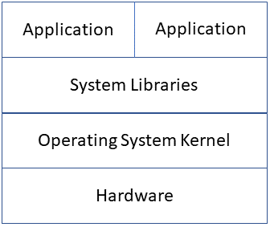
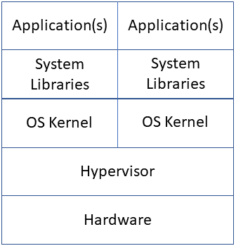
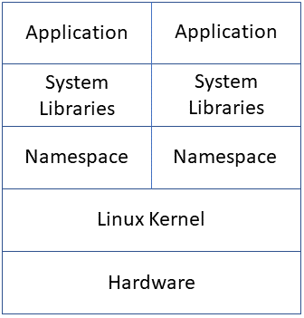
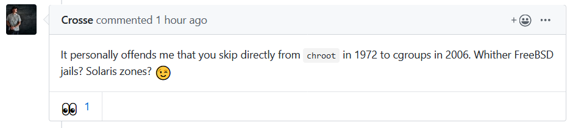
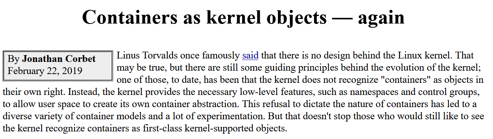

# Ripley's Thoughts on Containerization

Just a random collection of ideas to set the tone for the next few weeks

---
# What is the right size of a computer?
- We spend a lot of time clustering servers together to solve big problems
- We spend even more time subdividing servers to work on a lot of little problems
- We almost never look at a server and think it's the right size
- This talk is not about the elusive right-size server, or the pursuit of solving big problems with clusters

---
# Bare Metal Servers

- Let's frame this conversation in terms of four layers
- Resource allocation is very static and often requires a credit card to adjust
- Library versions can conflict between applications

---
# Virtual Machines

- Traditional subdivision used a hypervisor layer to create fake hardware
  - Foundations of this approach can be traced back to IBM S/370 LPARs in 1972
  - VMware brought it to Intel machines in 1998
- "Guest" operating systems ran largely unmodified
- Resource allocation was static and required a guest reboot to change
- Applications can be isolated from each other

---
# Containers

- People found themselves running huge numbers of nearly identical Linux machines
- Even for different distros, the kernel was nearly identical
- Namespaces allow the kernel to lie to applications, and believe they're running alone
- Resource allocation under one kernel can be very dynamic

---
# A brief aside with some caveats

---
# Beware of posting slides for review early as it can attract trolls



---
# A study of containerization shouldn't be limited to Linux
- FreeBSD introduced "jails" in 2000
- Solaris introduced "zones" in 2004
- Both of these have a much more thorough design, coming from operating systems with much more control of the entire development process
- Windows Subsystem for Linux could be considered a form of container (circa 2016)
- WSL2 is now virtualized

---


[https://lwn.net/Articles/780364/](https://lwn.net/Articles/780364/)

---
# Linux containers don't really "exist"
- Unlike better designed systems like FreeBSD or Solaris, containers are not a kernel object on Linux
- A Linux container is an illusion created by an automation system like Docker, that ties together various pieces like namespaces and cgroups
- Without a proper definition of their boundaries, there have been issues with host information leaking into containers or applications escaping
- Linux security technologies like SELinux, AppArmor, capabilities, or seccomp help enforce container boundaries

---
# What are namespaces?
- You've probably only thought of Linux in terms of one global namespace
- All users and programs share one view of the system
- Namespaces can restrict a user or application's view of the system

---
# What namespaces are there?
- Mount - the view of filesystems and directories
- Process ID - the view of running processes and map fake process IDs to real PIDs (PID 1, etc)
- Network - what IP address is in use
- IPC - which message queues and semaphores are in use
- UTS - the hostname of the system
- User ID - map fake user IDs to real UIDs (root UID 0, etc)

---
# cgroups
- CPU - assign CPU cores and time shares
- Memory - limit RAM allocation
- Network IO - limit network bandwidth
- Disk IO - limit filesystem bandwidth

You can use cgroups today inside systemd unit files to help control uncooperative services.

---
# Enter Docker
- chroot introduced in 1979
- cgroups introduced in 2006
- Mount namespaces in 2002, others in 2006
- Docker launched in 2010, docker in 2013
- One of the first to tie all of these technologies together

---
# Redhat's `docker` Concerns
- `docker` is implemented as one giant daemon binary, controlled by messages sent via a filesystem socket
- Containers are launched as children of this daemon, making it difficult to update while running
- Docker had little interest in fundamentally changing their architecture
- Redhat has launched a collection of replacement utilities
  - `buildah` for building containers
  - `podman` for running containers
  - `skopeo` for inspecting, downloading, and uploading containers
- These utilities run as the calling user, and launch containers directly under systemd

---
# Docker vs docker vs containers
- Multiple implementations have lead to the Linux Foundation launching the Open Container Initiative
- Packaging and description of containers are now standardized
- `docker` and `podman` among other friends like runC, CRI-O, or containerd
- Docker has a somewhat uncertain financial future, but `docker` is an Apache licensed project

---
# How is a container built? Dockerfile
- Describes the base layer of the container
- Describes the steps used to build the container
- Describes the network requirements of the container
- Sets the binary that will run when the container is launched

---
# How is a container built? Filesystem layers
- Each step of the Dockerfile build creates a layer
- Files deleted in later steps persist in the early layers
- Docker attempts to cache each layer, but one miss and all later layers must be rebuilt
- This leads to some terrible side effects and weird hacks around them

---
# Dockerfile worst case scenario
```
FROM ubuntu:18.04

COPY index.html /var/www/html # frequent changes here invalidate layers

RUN apt-get update # huge download creates layer
RUN apt-get install -y apache2
RUN apt-get clean # create a huge negative layer

EXPOSE 80

CMD ["/usr/sbin/apache2", "-D", "FOREGROUND"]
```

---
# Dockerfile better example
```
FROM ubuntu:18.04

# Only preserve the Apache package
RUN apt-get update && apt-get install -y apache2 && apt-get clean

# Keep the most volatile layer at the end
COPY index.html /var/www/html

EXPOSE 80

CMD ["/usr/sbin/apache2", "-D", "FOREGROUND"]
```

---
# Kubernetes

- Kubernetes is a scheduling engine for containers
- Originated at Google, inspired by their internal project Borg
- Logo is a reference to the Greek word helmsman/pilot, but the seven sided wheel is also a tribute to Seven of Nine, the friendly Borg
- Abbreviated K8s - "k"-eight random letters-"s"

---
# Kubernetes Components
- Kubernetes is a scheduling engine that relies on a plugin ecosystem to build solutions
- Deployment files describe the resource needs of each container
- Replicas are distributed around the cluster
- Container updates can be slowly distributed to allow for testing and validation
- Plugins for:
  - Storage
  - Networking
  - User authentication/authorization
  - Container runtime (Docker, etc)

---
# Kubernetes Objects
- Pods - a group of containers sharing a namespace
- ReplicaSets - defines the number of running copies of an application
- Services - provides a common entry point a group of replicas
- Volumes - provides persistent storage to pods
- Namespaces - groups resources by project/user
- StatefulSets - manages workloads like databases that cannot be destroyed and recreated easily

---
# Kubernetes Distros
- Amazon/Google/Azure have managed solutions
- Redhat Openshift
- Rancher Kubernetes
- VMware PKS

---
# The End
- Docker hands-on demo hopefully next week
- Kubernetes hands-on the week after
- Questions?