# Information Security

UUG Spring 2023

---

"The three golden rules to ensure computer security are: do not own a computer; do not power it on; and do not use it."
— Robert Morris

---

## CIA Triad

- Confidentiality
- Integrity
- Availability

---

<!-- Stallings, William, and Lawrie Brown. Computer Security: Principles and Practice. 4th ed., Pearson, 2017. -->

## Confidentiality

- Assures that private or confidential information is not made available or disclosed to unauthorized individuals

---

<!-- Stallings, William, and Lawrie Brown. Computer Security: Principles and Practice. 4th ed., Pearson, 2017. -->

## Integrity

- Assures that information and programs are changed only in a specified and authorized manner

---

<!-- Stallings, William, and Lawrie Brown. Computer Security: Principles and Practice. 4th ed., Pearson, 2017. -->

## Availability

- Assures that systems work promptly and service is not denied to users

---

## Which Aspect of the CIA Triad is Most Important?

---

<!-- Stallings, William, and Lawrie Brown. Computer Security: Principles and Practice. 4th ed., Pearson, 2017. -->

## Additional CIA Triad Concepts

- Authenticity

  - The property of being genuine and being able to be verified and trusted

    - Confidence in the validity of a transmission, a message, or message originator

- Accountability

  - The security goal that generates the requirement for actions of an entity to be traced uniquely to that entity.

    - Non-repudiation

---

## Cryptography Concepts

- Plaintext

  - The item we plan on encrypting. Human-readable.

- Key

  - A secret.

- Ciphertext

  - The output of encryption. Not human-readable.

- Cleartext

  - The output of decryption (same as the input plaintext).

---

<!-- Wikipedia contributors. "Kerckhoffs's principle." Wikipedia, The Free Encyclopedia. Wikipedia, The Free Encyclopedia, 30 Apr. 2023. Web. 11 Apr. 2023.  -->

## Kerckhoffs's principle

- Security must reside entirely in the secret key

- Assume all other information is known by the attacker

- This includes the:
  - key-space (128-bit, 256-bit)
  - algorithm (AES, RSA, ECC)
  - hardware (Enigma)

---

## Types of Ciphers

- Block

  - Message is partitioned into fixed-size blocks (typically 64 or 128-bits)

    - DES, AES, RSA

- Stream

  - Encrypts a digital data stream one bit or one byte at a time.

    - RC4, OTP (One-time pad)

---

<!-- Wikipedia contributors. "Block cipher mode of operation." Wikipedia, The Free Encyclopedia. Wikipedia, The Free Encyclopedia, 2 Apr. 2023. Web. 11 Apr. 2023. -->

## Electronic Codebook (ECB)

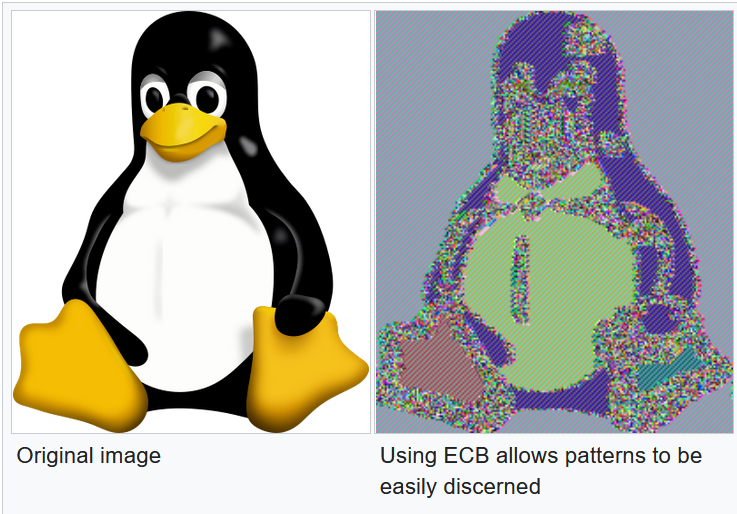

---

<!-- Wikipedia contributors. "Block cipher mode of operation." Wikipedia, The Free Encyclopedia. Wikipedia, The Free Encyclopedia, 2 Apr. 2023. Web. 11 Apr. 2023. -->

## Cipher Block Chaining (CBC)

- Duplicate data is not reflected in ciphertext

- Malformed/incorrect blocks affect all following blocks

---

<!-- Wikipedia contributors. "Block cipher mode of operation." Wikipedia, The Free Encyclopedia. Wikipedia, The Free Encyclopedia, 2 Apr. 2023. Web. 11 Apr. 2023. -->

## Output feedback (OFB)

- Can prepare encryption and decryption in advance

- Malformed/incorrect blocks affect only the current block

---

<!-- Adetunji, Daniel. “Symmetric and Asymmetric Key Encryption – Explained in Plain English.” FreeCodeCamp.org, FreeCodeCamp.org, 5 Apr. 2023, <https://www.freecodecamp.org/news/encryption-explained-in-plain-english/>. -->

## Types of Encryption

| Symmetric                     | Asymmetric                                                       |
| ----------------------------- | ---------------------------------------------------------------- |
| Single key                    | Two linked/related keys                                          |
| Fast                          | Slow                                                             |
| Good for large data transfers | Good for small data transfers                                    |
| Only provides confidentiality | Can provide confidentiality, authentication, and non-repudiation |

---

<!-- Wikipedia contributors. "Symmetric-key algorithm." Wikipedia, The Free Encyclopedia. Wikipedia, The Free Encyclopedia, 29 Mar. 2023. Web. 5 Apr. 2023. -->

## Symmetric Encryption

---

## "Perfect" Encryption - One-Time Pad (OTP)

- Major rules of OTP:
  - Key must be the same size as the message
  - Key must be truly random
  - Keys must never be reused

---

## One-Time Pad Encryption

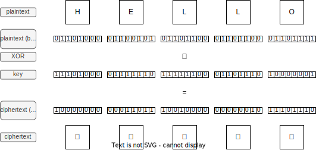

---

## One-Time Pad Decryption

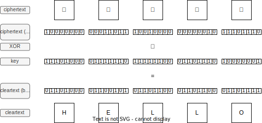

---

## Is One-Time Pad practical to implement?

---

<!-- Wikipedia contributors. "Feistel cipher." Wikipedia, The Free Encyclopedia. Wikipedia, The Free Encyclopedia, 31 Jul. 2022. Web. 10 Apr. 2023. -->

## Feistel Cipher

- Created by German physicist Horst Feistel and patented the early 1970's
- The Feistel Cipher is a design model (template) that is used to create different block ciphers.
  - Blowfish, DES, RC5, Twofish

---

## How the Feistel Cipher Works

---

<!-- Wikipedia contributors. "Data Encryption Standard." Wikipedia, The Free Encyclopedia. Wikipedia, The Free Encyclopedia, 30 Mar. 2023. Web. 10 Apr. 2023. -->

## Data Encryption Standard

- A symmetric-key algorithm standardized in 1977
- Incorporates 16 Feistel Cipher rounds
- Has a block size of 64-bits
- Has a key size of 56-bits
  - Purposely neutered by the NSA to make brute-force attacks easier

---

## How the Data Encryption Standard Works

- Expansion: Function that takes 32-bit block increased to 48-bits
- Key mixing: XOR operation with the subkey
- Substitution: Lookup table
- Permutation: Bit shuffling

---

<!-- Wikipedia contributors. "Triple DES." Wikipedia, The Free Encyclopedia. Wikipedia, The Free Encyclopedia, 15 Mar. 2023. Web. 10 Apr. 2023. -->

## Triple DES (3DES)

- Published in 1981
- Incorporates 48 Feistel Cipher rounds
- Has a block size of 64-bits
- Has a key size of 168-bits (three 56-bit keys)
- Officially deprecated by NIST at the end of 2023

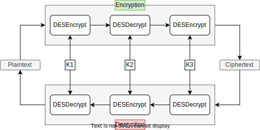

---

<!-- Stallings, William. Cryptography and Network Security. 7th ed., Pearson, 2016. -->

<!-- Wikipedia contributors. "Advanced Encryption Standard." Wikipedia, The Free Encyclopedia. Wikipedia, The Free Encyclopedia, 9 Mar. 2023. Web. 11 Apr. 2023. -->

## Advanced Encryption Standard (AES)

- Published in 1998 by Joan Daemen and Vincent Rijmen under the name Rijndael
- Selected by NIST in 2001 to replace DES

|         | Key length (bits) | Block size (bits) | # of Rounds |
| ------- | ----------------- | ----------------- | ----------- |
| AES-128 | 128               | 128               | 10          |
| AES-192 | 192               | 128               | 12          |
| AES-256 | 256               | 128               | 14          |

---

## How AES works (1 of 2)

---

## How AES works (2 of 2)

- SubBytes
- ShiftRows
- MixColumns
- AddRoundKey

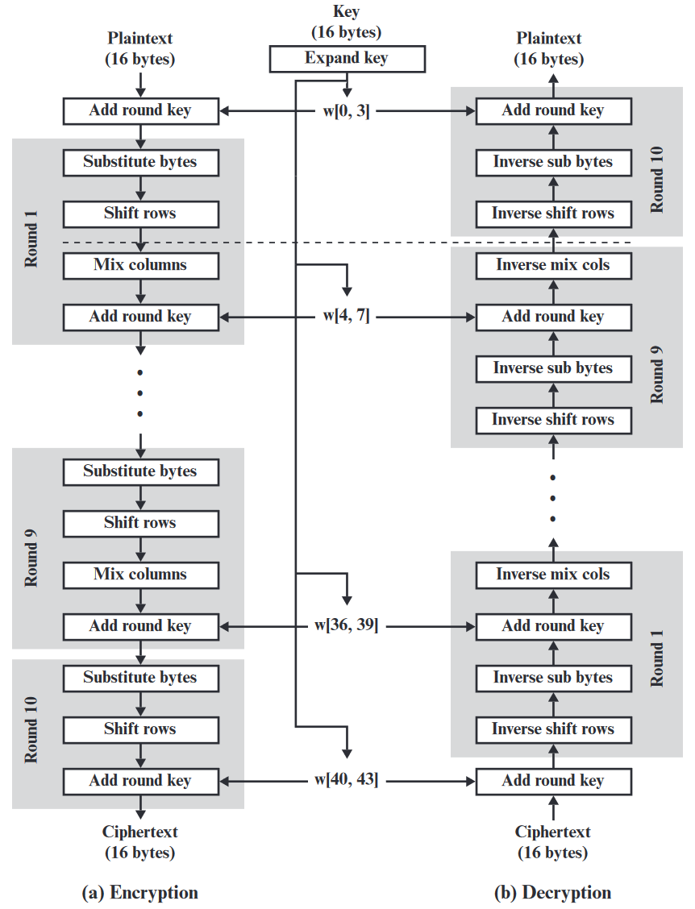

---

## How AES works - SubBytes

- Byte-wise table lookup

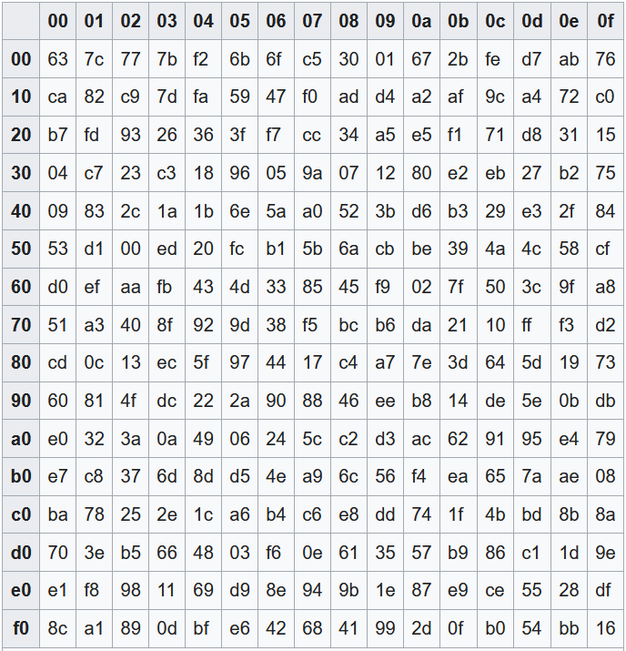

---

## How AES works - ShiftRows

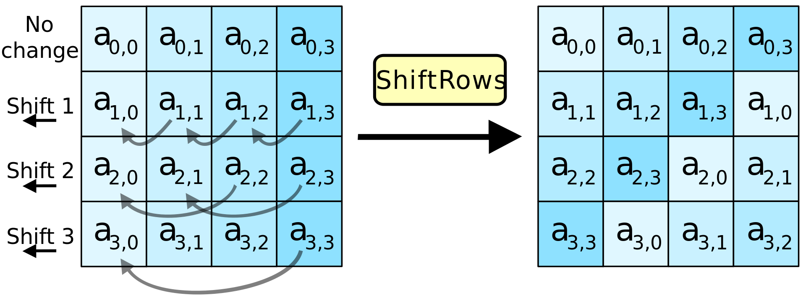

---

## How AES works - MixColumns

- Shuffles bits using special matrix multiplication
  - Uses polynomials, XOR, and modulo

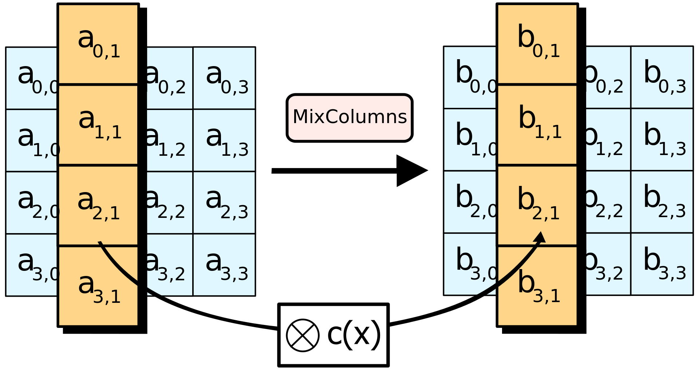

---

## How AES works - AddRoundKey

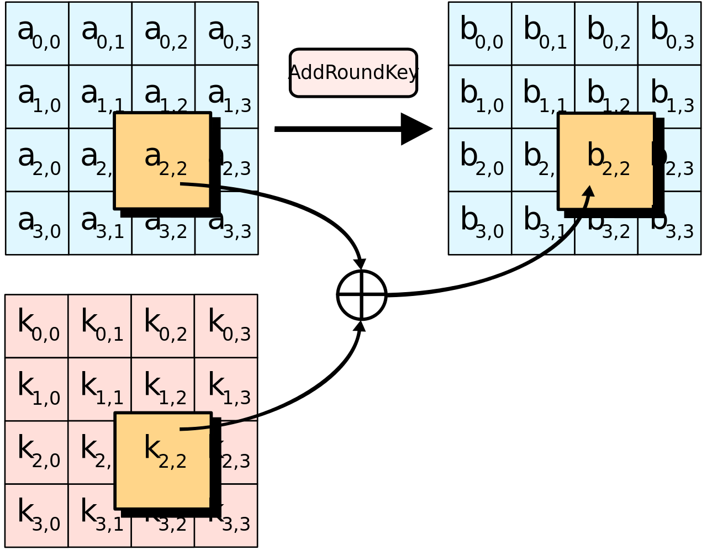

---

<!-- Wikipedia contributors. "Public-key cryptography." Wikipedia, The Free Encyclopedia. Wikipedia, The Free Encyclopedia, 4 May. 2023. Web. 11 Apr. 2023.  -->

## Asymmetric Encryption

---

<!-- Wikipedia contributors. "Diffie–Hellman key exchange." Wikipedia, The Free Encyclopedia. Wikipedia, The Free Encyclopedia, 8 Apr. 2023. Web. 11 Apr. 2023. -->

## Diffie Hellman key exchange (DH)

- An asymmetric-key protocol conceived by Ralph Merkle that was published by Whitfield Diffie and Martin Hellman in 1976.

- Previously been discovered by a British intelligence agency in 1969.

---

## How DH Works (1 of 2)

- Alice and Bob publicly agree to use the modulus p=23 and base g=5

| Alice                               | Bob                             |
| ----------------------------------- | ------------------------------- |
| α = 4                               | β = 3                           |
| A = gᵃ mod p                        | B = gᵇ mod p                    |
| A = 5⁴ mod 23 = 625 mod 23 = 4      | B = 5³ mod 23 = 125 mod 23 = 10 |
| sᵃ = Bᵃ mod p                       | sᵇ = Aᵇ mod p                   |
| sᵃ = 10⁴ mod 23 = 10000 mod 23 = 18 | sᵇ = 4³ mod 23 = 64 mod 23 = 18 |

---

## How DH Works (2 of 2)

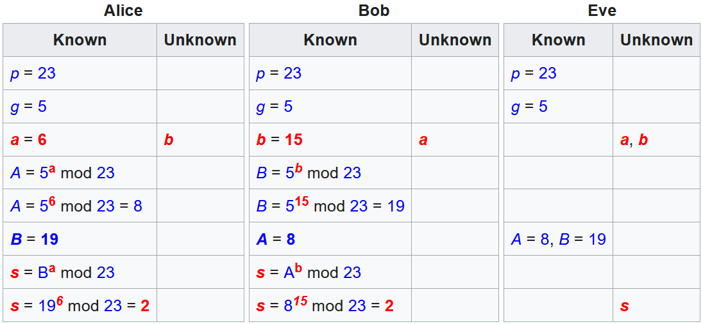

---

<!-- Wikipedia contributors. "RSA (cryptosystem)." Wikipedia, The Free Encyclopedia. Wikipedia, The Free Encyclopedia, 7 Apr. 2023. Web. 11 Apr. 2023. -->

## Rivest-Shamir-Adleman (RSA)

- An asymmetric-key algorithm published in 1977 by Ron Rivest, Adi Shamir, and Leonard Adleman
- Relies on the difficulty of factoring the product of two large prime numbers
- Common key lengths in RSA
  - 1024, 2048, 3072, 7680, 15360

---

## How RSA Works (1 of 2)

- p, q : chosen random prime integers (private)
- n : product of p and q, modulus for the public/private keys (public)
- Φ(n) : (Phi of n) Euler totient
- e : chosen integer that is (public):
  - greater than one and less than the totient
  - co-prime to the totient
  - shares no common factors with the totient
- d : calculated multiplicative inverse of e mod the totient (private)

---

## How RSA Works (2 of 2)

- Public key

  - {e, n}

- Private key
  - {d, n}

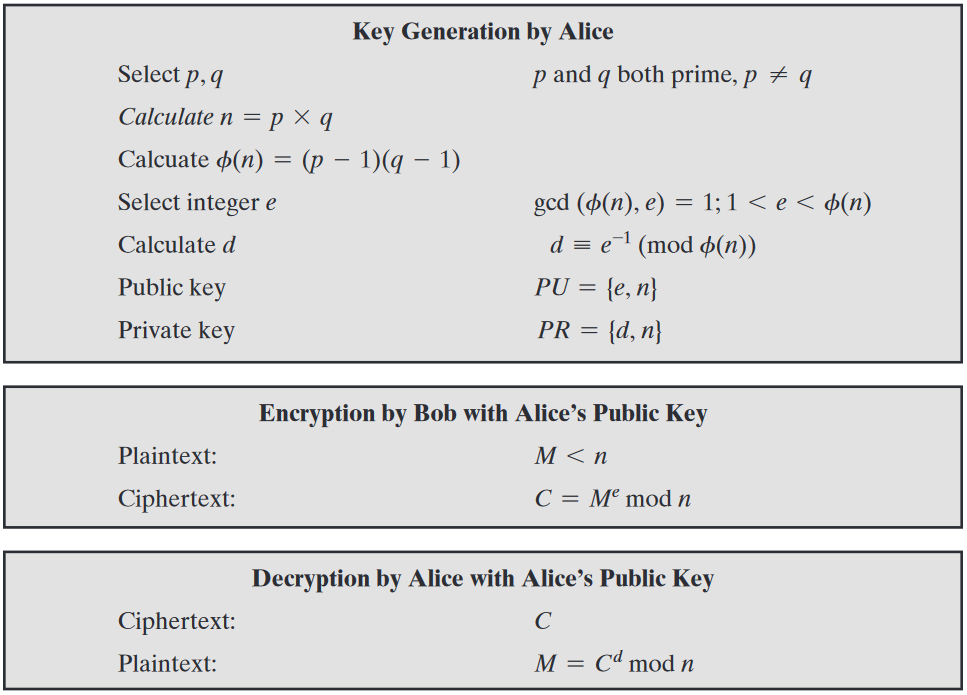

---

## RSA Example (1 of 3)

- p = 5, q = 7

- n = 5 × 7 = 35

- Φ(n) = (5 - 1) × (7 - 1) = 4 × 6 = 24

- e = 1 < 5 < 24

  - can check if co-prime using Euclid's Algorithm (GCD)

- d = 5⁻¹ mod 24 = 5
  - can solve this using Extended Euclid's Algorithm (XGCD)

---

## RSA Example (2 of 3)

- Public Key: {5, 35}

- plaintext (M): 23

  - ciphertext (C) = Mᵉ mod n

- C = 23⁵ mod 35 = 6436343 mod 35 = 18

---

## RSA Example (3 of 3)

- Private Key: {5, 35}

- ciphertext (C): 18

  - cleartext (M) = Cᵈ mod n

- M = 18⁵ mod 35 = 1889568 mod 35 = 23

---

<!-- Wikipedia contributors. "Elliptic-curve Diffie–Hellman." Wikipedia, The Free Encyclopedia. Wikipedia, The Free Encyclopedia, 5 Feb. 2023. Web. 11 Apr. 2023. -->

## Elliptic-Curve Cryptography (ECC)

- An asymmetric-key cryptography approach independently suggested by Neal Koblitz and Victor S. Miller in 1985.
- Relies on the discrete logarithm problem over the elliptic curve y² = x³ + ax + b
- Elliptic-curve calculations are more computationally demanding allowing keys to be smaller than the equivalent RSA counterparts

---

<!-- Robert Pierce. "Elliptic Curve Diffie Hellman." YouTube. 10 Dec. 2014. <https://youtu.be/F3zzNa42-tQ>. -->

## How ECC Works (1 of 4)

- Publicly agreed on curve (a=2, b=2, q=17):
  - y² = x³ + ax + b
  - y² = x³ + 2x + 2
- Publicly agreed on generator (G)
  - G=(5,1)
- Publicly agreed order of G (n)
  - n = 19

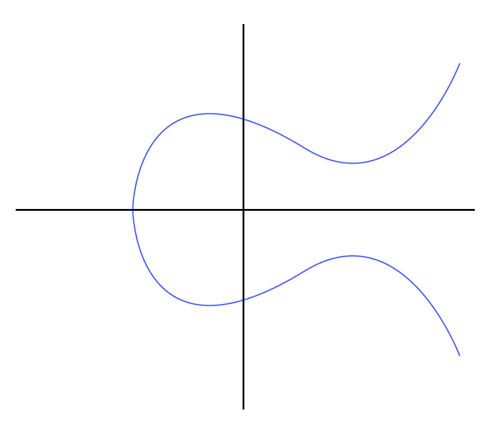

---

## How ECC Works (2 of 4)

- G=(5,1)

| Alice  | Bob    |
| ------ | ------ |
| α = 3  | β = 9  |
| Α = 3G | Β = 9G |

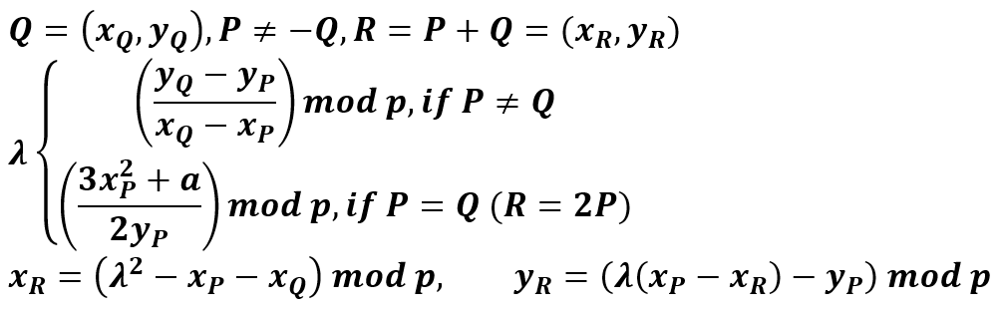

---

## How ECC Works (3 of 4)

- Alice (3G)

  - G + G = 2G
  - 2G + G = 3G (10,6)

- Bob (9G)
  - G + G = 2G
  - 2G + 2G = 4G
  - 4G + 4G = 8G
  - 8G + G = 9G (7,6)

---

## How ECC Works (4 of 4)

| Alice                               | Bob                                 |
| ----------------------------------- | ----------------------------------- |
| Α = 3G = (10,6)                     | Β = 9G = (7,6)                      |
| αΒ = 3Β = 3(9G) = 27G = 8G = (13,7) | βΑ = 9Α = 9(3G) = 27G = 8G = (13,7) |

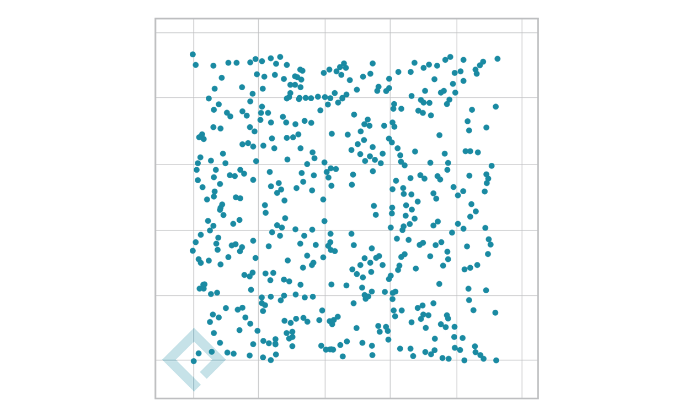

---

## Comparison of Symmetric and Asymmetric Algorithms

| Security Bits | Symmetric Encryption Algorithm | RSA   | ECC |
| ------------- | ------------------------------ | ----- | --- |
| 80            |                                | 1024  | 160 |
| 112           | 3DES                           | 2048  | 224 |
| 128           | AES-128                        | 3072  | 256 |
| 192           | AES-192                        | 7680  | 384 |
| 256           | AES-256                        | 15360 | 512 |

---

<!-- Wikipedia contributors. "Post-quantum cryptography." Wikipedia, The Free Encyclopedia. Wikipedia, The Free Encyclopedia, 9 Apr. 2023. Web. 11 Apr. 2023. -->

## Symmetric Encryption Quantum Threats

- Grover's Algorithm

  - A quantum brute-forcing algorithm that is effective against AES

  - Takes AES from O(N) to O(√N)

    - 2¹²⁸ → 2⁶⁴

    - 2¹⁹² → 2⁹⁶

    - 2²⁵⁶ → 2¹²⁸

---

<!-- Wikipedia contributors. "Post-quantum cryptography." Wikipedia, The Free Encyclopedia. Wikipedia, The Free Encyclopedia, 9 Apr. 2023. Web. 11 Apr. 2023. -->

## Asymmetric Encryption Quantum Threats

- Shor's Algorithm

  - A quantum algorithm for finding prime factors of an integer (DH, RSA) and discrete logarithms (ECC)

---

<!-- Wikipedia contributors. "Cryptographic hash function." Wikipedia, The Free Encyclopedia. Wikipedia, The Free Encyclopedia, 9 Mar. 2023. Web. 5 Apr. 2023. -->

## Hashing

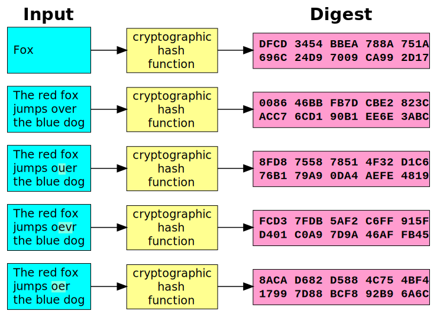

---

## Password Hashing

- password123

- SHA-256

  - ef92b778bafe771e89245b89ecbc08a44a4e166c06659911881f383d4473e94f

- password123D;%yL9TS:5PalS/d

  - 9C9B913EB1B6254F4737CE947EFD16F16E916F9D6EE5C1102A2002E48D4C88BD

- password123D;%yL9TS:5PalS/d + iterations

  - fc91e3c64406e6afb456303d93ecb7c22b7f7ddb7f89d7e3ca52de8c10c16525

---

## Storing Hashed Passwords - LAN Manager

- Morpheus:1010:B902F044A44585DF93E28745B8BF4BA6:D5D630DA69EBD8AB040D77BE7BB046DD:::

- username:user_id:LM_hash:NTLM_hash

- 14 character password

  - Converted to uppercase
  - Unused space filled with null bytes
  - Split in half with parity character added (two 8-byte segments)
  - Both halves are encrypted with DES and concatenated together

---

## Storing Hashed Passwords - New Technology LAN Manager

- Morpheus:1002:aad3b435b51404eeaad3b435b51404ee:d5d630da69ebd8ab040d77be7bb046dd:::

- username:user_id:LM_hash:NTLM_hash

- 14 character password

  - RC4 encryption

---

## Storing Hashed Passwords - sha512crypt

- Morpheus:\$6\$ykumbyCz$kb1zUhrB3wROIN1uoI94gfmAMjlTeeVhKkEtEZHYeIFIqD6CBiAQAlFB9uqYHHVO1doCNJbV56tC4gJi/L0ng0:1001:1001::/home/morpheus:/bin/sh

- username:hash_algorithm:user_id:group_id:home_directory:default_shell

---

## `man 5 crypt` - sha512crypt

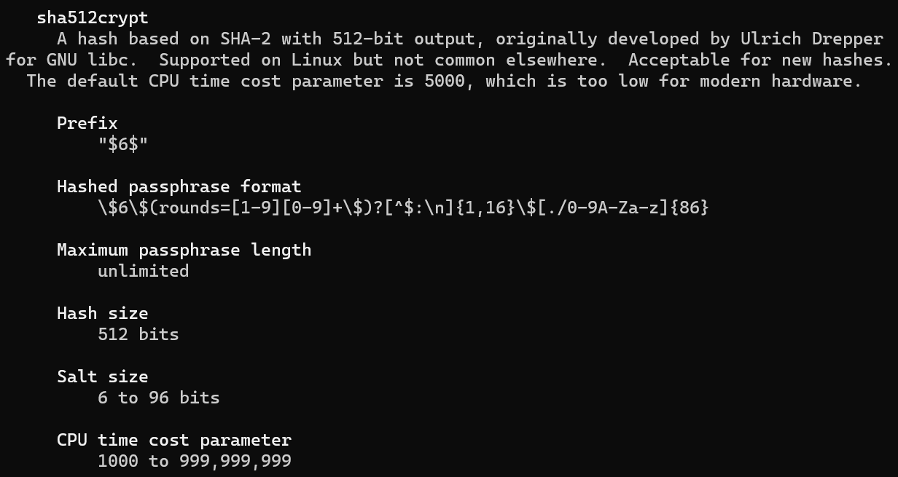

---

## `man 5 crypt` - yescrypt

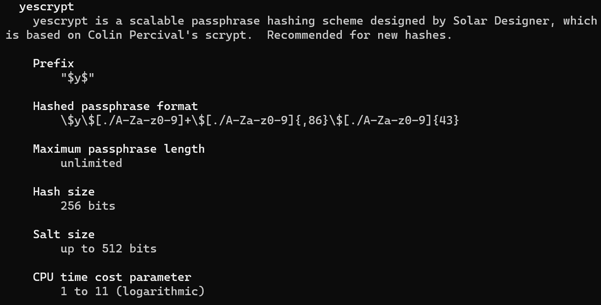

---

## Password Hashing Explained

- Hashing protects against dictionary attacks

- Salts protect against rainbow tables

  - Precomputed hashes

- Iterations increase the computation time

- Hash + Salt + Iterations:

  - susceptible to dictionary attacks if the algorithm is known
