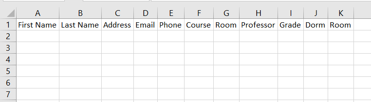
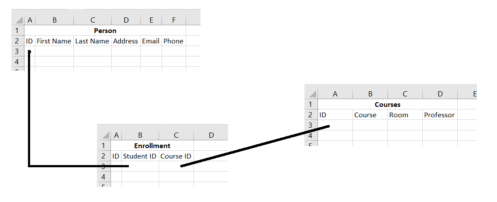

# Databases

---
# A brief history

- Flat files - available on every computer ever
- Hierarchical - data stored in a tree
  - Biggest example is the Windows Registry
- Network model - similar to hierarchical, but children can have multiple parents
  - Standardized in 1969, and largely abandoned in the 80's
- Relational model - data stored as records in tables, with relationships between columns of the tables
- Object oriented - outgrowth of relational databases that specialize in object persistence

---
# Where we are today

- Relational databases own the market
- Object oriented have larged faded
- NoSQL databases are an area of major investment
  - Simplified prototyping
  - Relaxed reliability constraints
  - Matured significantly lately

---
# Four essential acronyms - (R)DBMS

- Relational
- DataBase
- Management
- System

---
# Four essential acronyms - ACID

Why use a database?

- Atomicity
- Consistency
- Isolation
- Durability

---
# Atomicity

- Requires that database modifications must follow an "all or nothing" rule. Each transaction is said to be atomic if when one part of the transaction fails, the entire transaction fails and database state is left unchanged.

# Consistency

- Ensures that the database remains in a consistent state; more precisely, it says that any transaction will take the database from one consistent state to another consistent state. When rules are defined between database tables, no data is allowed that violates those rules.

---
# Isolation

Isolation refers to the requirement that other operations cannot access or see data that has been modified during a transaction that has not yet completed.

# Durability

The ability of the DBMS to recover the committed transaction updates against any kind of system failure (hardware or software). Durability is the DBMS's guarantee that once the user has been notified of a transaction's success, the transaction will not be lost.

---
# Four essential acronyms - CRUD

The four essential SQL operations

- Create
- Retrieve
- Update
- Delete

---
# Four essential acronyms - SQL

- Structured
- Query
- Language

---
# So how do databases store information?

- Tables!
  - Rows for each entity
  - Columns for each attribute
- "Data normalization" to keep things from becoming a mess
  - Do not store duplicated data
  - Define separate tables and link them together by unique IDs

---


---


---
# Let's do some queries

```sql
SELECT * FROM employees;
```

```sql
SELECT first_name, last_name from EMPLOYEES;
```

```sql
SELECT * FROM employees
WHERE employee_id = 100;
```

```sql
SELECT * FROM employees
ORDER BY hire_date DESC;
```

---
# Let's do some queries

```sql
SELECT count(*) FROM employees;
```

```sql
SELECT DISTINCT job_id FROM employees;
```

```sql
SELECT job_id, count(*) from EMPLOYEES
GROUP by job_id;
```

```sql
SELECT job_id, count(*) from EMPLOYEES
GROUP by job_id
HAVING count(*) > 5;
```

---
# Let's do some queries

```sql
SELECT * FROM jobs;
```

```sql
SELECT e.first_name, e.last_name, j.job_title
FROM employees e, jobs j
WHERE e.job_id = j.job_id
ORDER BY job_title;
```

---
# Let's do some queries

```sql
SELECT e.first_name, e.last_name,
d.department_name, l.state_province, c.country_name

FROM employees e, departments d, locations l, countries c

WHERE e.department_id = d.department_id
AND d.location_id = l.location_id
AND l.country_id = c.country_id

ORDER BY country_name, state_province;
```
