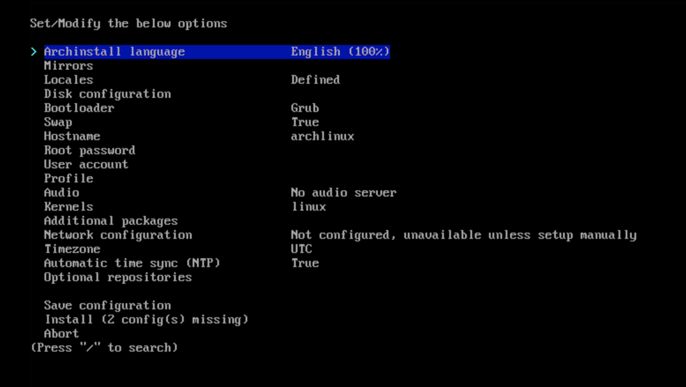
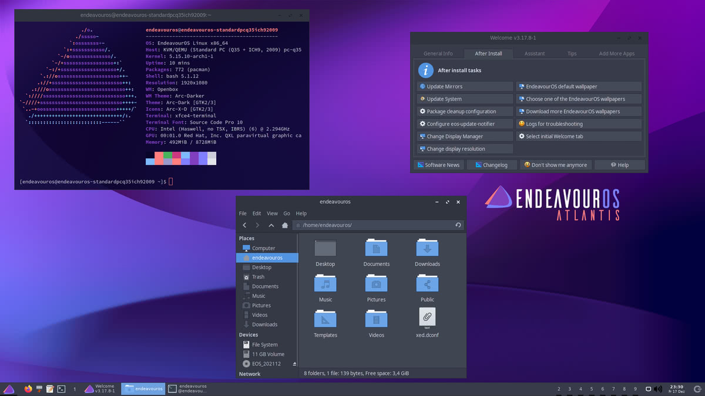
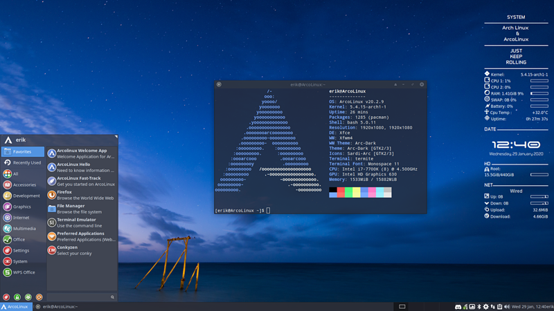
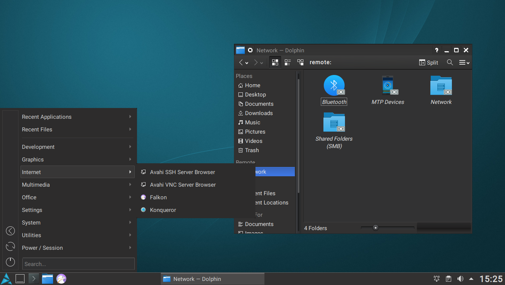

# Linux Distros - Arch Linux

Connor Sample - <https://tabulate.tech>

---

## What is Arch?

- Lightweight and flexible
- Designed for simplicity and cutsomization
- Rolling release

---

## Package Manager

- What is a package manager?
- Pacman may be less intuitive than other options

---

| Pacman                  | Apt                      | zypper (for fun)      |
| ----------------------- | ------------------------ | --------------------- |
| `pacman -S <package>`   | `apt install <package>`  | `zypper in <package>` |
| `pacman -R <package>`   | `apt remove <package>`   | `zypper rm <package>` |
| `pacman -Syu`           | `apt upgrade`            | `zypper dup`          |
| `pacman -Rns <package>` | `apt autoremove --purge` |                       |
| `pacman -Ss`            | `apt search`             | `zypper se`           |

<https://wiki.archlinux.org/title/Pacman/Rosetta>

---

## AUR

- Community driven package repository
- Build scripts instead of binaries
- Huge variety of software
- Many other distros make you use methods that aren't tracked by the package manager

| Official        | AUR             |
| --------------- | --------------- |
| 14,775 packages | 87,797 packages |

---

## Installation

- No GUI
- `archinstall`
- May encounter issues if installing at JMU (WPA2E)

---

---

## Derivatives

- EndeavourOS
- Garuda Linux
- ArcoLinux
- Artix (runit)

- **SEPERATELY**: Manjaro

Warning for the low resolution photos

---

---

---

---

---

---

## Potential Downfalls

- Steep learning curve
- Manual installatino process
- Maintenance/rolling release

---

## Use Case

- Mainly used on personal computers
- Not typically found on servers due to release model

---

## In conclusion...
