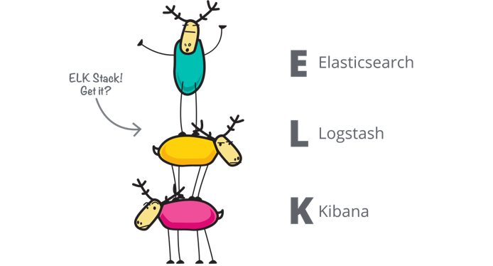
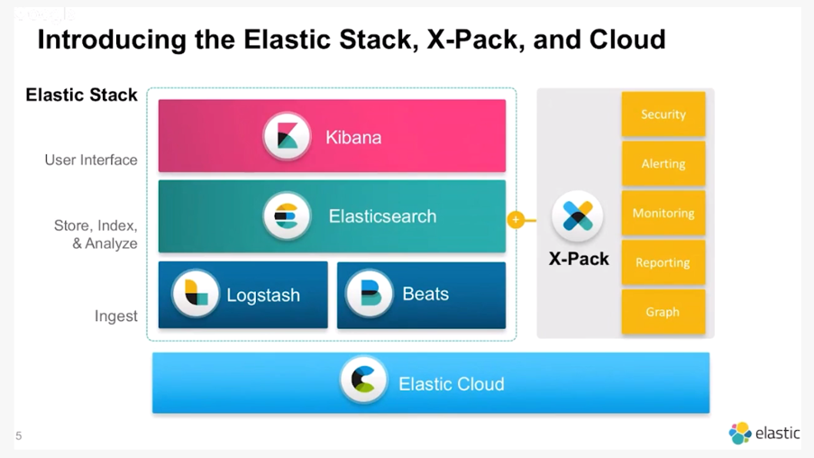
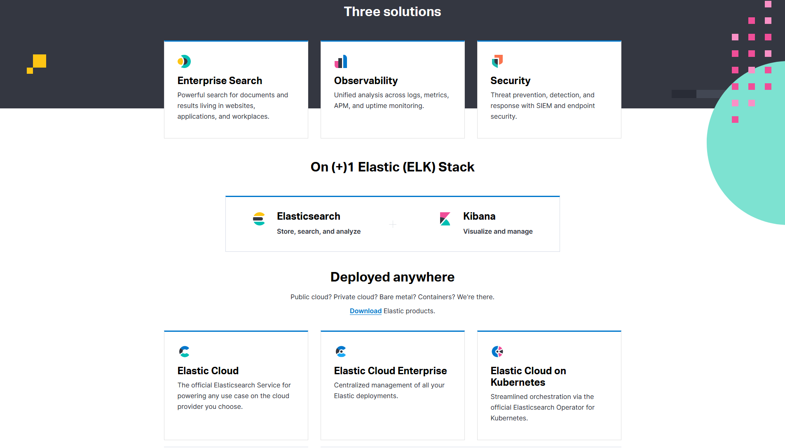

# ELK / Elastic Stack

What is Elastic?

---
# In the early days….

---
# Along came Beats to the ELK family, giving us the ELK-B(ee)

---
# Elastic Universe circa 2018

---

---
# Licensing

- Elastic is distributed under an Apache 2 “open core” model
- X-Pack features require a license purchase
- The source code for X-Pack is published, but under a restrictive license
- Elastic has an interesting philosophy on openness

---
# Elasticsearch

- First and foremost, a search engine powered by Apache Lucene
- Primarily an append-only database
- Schema is good, but searching all the things covers for a lot of mistakes
- Elastic rigorously pursues reliability and scalability
- Scales through sharding and replication
  - Shards - split incoming data over multiple files, potentially on several nodes
  - Replication - copy data files over multiple nodes
  - Sharding improves write performance
  - Replication improves read performance
- Primarily accessed via a REST API
- Somebody realized early on that feeding log files into a common database and searching them was handy

---
# Observability

- APM - embed an agent into your web app to report transaction performance details
- Logs - collect your application logs into one central database for searching and reporting
- Metrics - collect numeric data about host performance including CPU, memory, disk, and network

---
# Full Text

- Site search - crawl your web site, and build a Google-like index
- Workspace search - connect your cloud apps for unified search across Google Docs, Salesforce, ServiceNow, Sharepoint, JIRA, etc

---
# Security

- Endpoint - anti-virus agent runs on machines, gathers data, and applies policy
- SIEM - aggregate security events from endpoint machines and network flow data

---
# Not mentioned on the homepage - geospatial

- Store points and polygons
- Search by distance or intersection

---
# Logstash

- Intermediary between input data and Elasticsearch database
- ETL (extract, transform, load) pipeline for data cleanup
- Written in JRuby, but being converted to full Java
- Skipping it tonight

---
# Logstash Inputs

|  | | | | |
| --- | --- | --- | --- | --- |
| azure_event_hubs | generator | jms | redis | syslog |
| beats | github | jmx | relp | tcp |
| cloudwatch | google_pubsub | kafka | rss | twitter
| couchdb_changes | graphite | kinesis | s3 | udp
| dead_letter_queue | heartbeat | log4j | salesforce | unix
| elasticsearch | http | lumberjack | snmptrap | varnishlog
| exec | http_poller | meetup | sqlite | websocket
| file | imap | pipe | sqs | wmi

---
# More Logstash inputs

|  | | | | |
| --- | --- | --- | --- | --- |
| ganglia | irc | puppet_facter | stdin | xmpp
| gelf | jdbc | rabbitmq | stomp | |

---
# Logstash Codecs - decode incoming data
| | | |
| --- | --- | --- |
| avro | fluent | netflow |
| cef | graphite | nmap |
| cloudfront | gzip_lines | plain |
| collectd | json | protobuf |
| dots | json_lines | rubydebug |
| edn | line | |
| edn_lines | msgpack | |
| es_bulk | multiline | |

---
# Logstash filters - transform data
| | | | | |
| --- | --- | --- | --- | --- |
| aggregate | dissect | geoip | metricize | throttle |
| alter | dns | grok | metrics | tld |
| cidr | drop | i18n | mutate | translate |
| cipher | elapsed | jdbc_static | prune | truncate |
| clone | elasticsearch | jdbc_streaming | range | urldecode |
| csv | environment | json | ruby | useragent |
| date | extractnumbers | json_encode | sleep | uuid |
| de_dot | fingerprint | kv | split | xml |

---
# Beats

- Lightweight data shipping agents
- Written in GoLang
- Static binary all the things!
- Easy cross-compilation
- Uniform configuration due to libbeat at the core

---
# Beats

|  | | | | |
| --- | --- | --- | --- | --- |
| Packetbeat | apexbeat | collectbeat | fastcombeat | etcdbeat |
| Filebeat | burrowbeat | connbeat | flowbeat | execbeat |
| Winlogbeat | hsnburrowbeat | consulbeat | gabeat | factbeat |
| Metricbeat | cloudflarebeat | dockbeat | gcsbeat | fastcombeat |
| Heartbeat | cloudfrontbeat | Elasticbeat | githubbeat | flowbeat |
| Auditbeat | cloudtrailbeat | etcdbeat | gpfsbeat | gabeat |
| amazonbeat | cloudwatchmetricbeat | execbeat | hackerbeat | gcsbeat |
| apachebeat | cloudwatchlogsbeat | factbeat | Hsbeat | githubbeat |

---
# Beats

|  | | | | |
| --- | --- | --- | --- | --- |
| gpfsbeat | journalbeat | mqttbeat | packagebeat | redisbeat |
| hackerbeat | kafkabeat | mysqlbeat | phpfpmbeat | retsbeat |
| hsbeat | kafkabeat2 | nagioscheckbeat | pingbeat | rsbeat |
| httpbeat | krakenbeat | nginxbeat | prombeat | saltbeat |
| hwsensorsbeat | lmsensorsbeat | nginxupstreambeat | prometheusbeat | serialbeat |
| icingabeat | logstashbeat | nsqbeat | protologbeat | springbeat |
| iobeat | mcqbeat | nvidiagpubeat | pubsubbeat | tracebeat |
| jmxproxybeat | mongobeat | openconfigbeat | redditbeat | twitterbeat |

---
# Beats

| |
| --- |
| udpbeat |
| udplogbeat |
| unifiedbeat |
| uwsgibeat |
| varnishlogbeat |
| varnishstatbeat |
| vaultbeat |
| wmibeat |

---
# Kibana

- Web front end to query and visualize Elasticsearch data
- Written in Node.js
- Three key things to note:
  - App picker
  - Time picker
  - Index picker

---
# Demo time

---
# Sysmon - a brief aside
“System Monitor (Sysmon) is a Windows system service and device driver that, once installed on a system, remains resident across system reboots to monitor and log system activity to the Windows event log. It provides detailed information about process creations, network connections, and changes to file creation time. By collecting the events it generates using Windows Event Collection or SIEM agents and subsequently analyzing them, you can identify malicious or anomalous activity and understand how intruders and malware operate on your network.”

---
# Demo time
<http://elastic.ripleymj.net:5601>
ssh ec2-user@elastic1.ripleymj.net Packetbeat, metricbeat, auditbeat
ssh ec2-user@elastic2.ripleymj.net Metricbeat, packetbeat, auditbeat, filebeat
 | <http://elastic2.ripleymj.net/manual>
Remote Desktop ec2-user@elastic-win.ripleymj.net

Password: uugsupersecret
