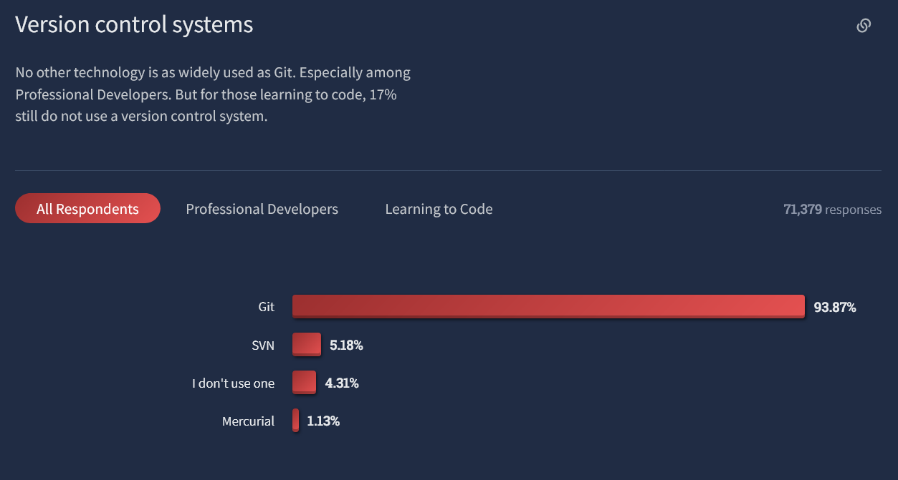
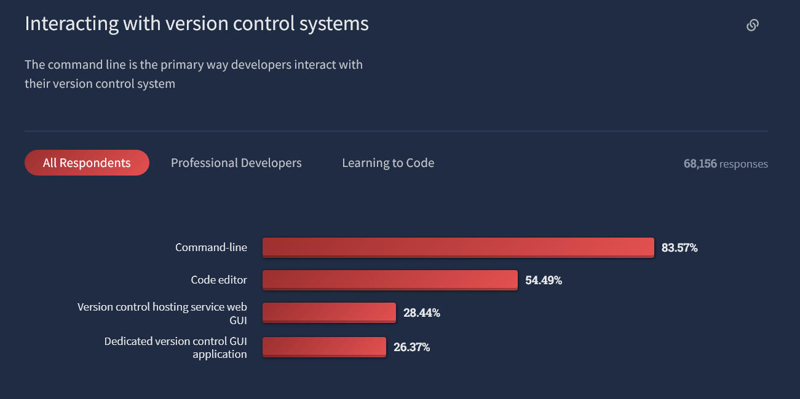
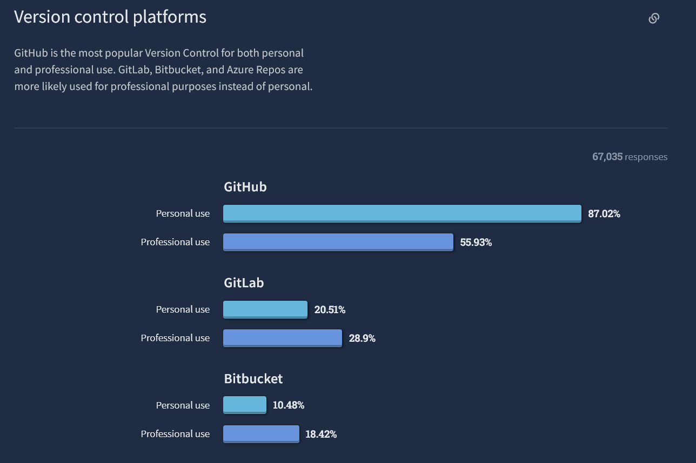
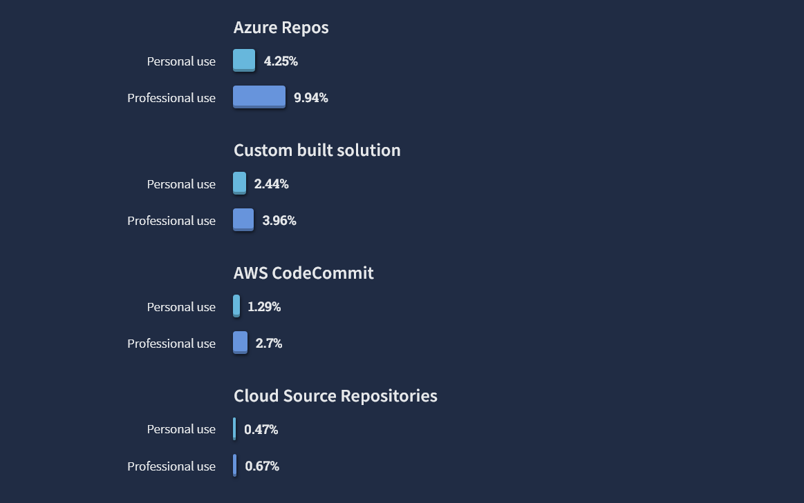

# Git 101 - Warmup

Take a moment to create a GitHub account, or verify your password.

Please post your username in Discord (join code over there --> ) so we can get a little social network going.

Follow me @ripleymj.

---
# Roadmap

- 101 Git theory and solo usage
- 201 Git with a friend
- 301 Git with a group / advanced GitHub

---
# What is git?

- Git is a distributed version control system
- Git was started by Linus Torvalds out of frustration with existing systems
- Theories on git’s naming origin vary widely

---
# What is version control?

- A system for tracking changes to files
- A system for tracking the author of changes
- A system for coordinating changes

---
# "Distributed"?

- Everyone has a complete copy of the repository
- Any change can be made to the repository copy
- Changes can be synchronized between copies
- Repository synchronization requires both sides to agree on the __exact__
series of events in their history
  - There are __NO__ exceptions to this rule
- Branch-merge strategy allows private changes that can later be merged into
a common history in an orderly manner

---
# What’s the alternative?

- Centralized systems like Subversion are also available
- Repositories are cached locally, but are not authoritative copies
- Committing requires a connection to the central repository
- Much less flexibility, but much less chance of disagreement

---
# Git ecosystem survey

- StackOverflow conducts an annual survey of developer trends
- Until 2018 they asked about version control preferences
- In 2020, they asked what services you use with git
- Then git was just one of a dozen tools surveyed
- In 2022, the git questions returned

---

<https://survey.stackoverflow.co/2022/>

---

<https://survey.stackoverflow.co/2022/>

---

<https://survey.stackoverflow.co/2022/>

---

<https://survey.stackoverflow.co/2022/>

---
# So what about GitHub?

- A social network for git users
- A place to keep a backup repository copy
- A means to exchange changes between people
- A database of issues
- A database of change requests, comments, and approvals
- An API for running events on repository changes

---
# So what about GitHub?

- Remember that git is a tool, and GitHub is a provider of git services
- Other services:
  - GitLab
  - Bitbucket
  - Azure Repos, AWS CodeCommit, Google Cloud Source
- Other git implementations:
  - Eclipse EGit
  - GitHub Desktop
  - Git Bash (ok, so it's just a port)
- A [student pack](https://education.github.com/pack) is available

---
# What is git?

- Git stores a series of changes to files and attributes of that change
  - File diff, author, timestamp, previous change hash
- Change and attributes are hashed together to uniquely identify a commit
- Branches allow different authors to pursue different paths
  - Like an actual tree, branches can go their own way, but the trunk must be shared
- Never delete a commit: use a revert to undo, but that change is then logged
- Some leeway to rewrite history if your changes haven't been pushed and become
visible to others, or working on a private branch

---
# A note on branching and language

- Git-based projects have a primary branch, traditionally known as `master`
- You can develop new code on different branches, with the goal of integrating
that code back into the primary branch
- Terminology and language matter, and git's use of the term `master` is
considered insensitive and has been deprecated
- git and GitHub will both default to `main` now, but you may find older repos
that never renamed

---
# Help along the way

- Git uses man pages extensively to document its options and features
- One man page would be too much for all of git, so pages are hyphenated with
the git-command. For example:
  - `git commit` uses `git-commit(1)`
  - `git push` uses `git-push(1)`
- The `git(1)` man page exists to document the common options and provide an overview

---
# Demo Time

---
# Understanding GitHub security

GitHub no longer allows plain password use from the command line

1. Are you on a computer you frequently use?
    - Yes? Use SSH keys
    - No? ssh to stu, use SSH keys
    - No? Generate a disposable personal token

2. Do you already have SSH keys? `ls -l $HOME/.ssh` and look for id files
    - Yes? Cool!
    - No? Time to generate some

---
# Disposable "Personal Access" Token

- Top-right menu -> Settings
- Developer settings -> Personal Access Token -> Generate Token
- Note optional, probably just seven days, only check `repo`
- Click `Generate Token`, then copy that somewhere to use for the rest of this demo
- No, seriously, paste that somewhere right now. You can't get it back and will
have to make a new token
- This is now your password on the command line for the next seven days
- `git config --global credential.helper store` use carefully, but this can store your token in a plaintext file

---
# Generating SSH keys

- `ssh-keygen -t ed25519 -C "your_email@example.com"`
- Since you don't already have keys, accept the default file name - `.ssh/id_ed25519`
- Password is optional depending how much you trust the computer's security.
You'll be prompted for this password every time you use the key.

---
# Uploading SSH keys

- Cat your public key, either `.ssh/id_ed25519.pub` or `.ssh/id_rsa.pub`
- No, seriously, do not accidentally give away your private key non-.pub file
- Top-right menu -> Settings
- SSH and GPG keys
- New Key, give it a name, and paste your pub file contents

---
# SSH key bonus feature

- ssh keys can be used to expedite Linux logins
- Use `ssh-copy-id username@hostname` to copy your local key to a server
- Check `.ssh/authorized_keys` to see which keys you've already allowed
- Valid and possibly preferred to have separate keys for server logins vs GitHub

---
# Basic `git` configuration

By default, `git` will have your name and email configured to be your login
name@hostname. This is nice in some ways, but probably not your actual
email address. Let's fix this. Make sure you substitute all of your own info
in the following commands:

    git config --global user.name "Your Name"
    git config --global user.email "your@email.address"
    git config --global color.ui true

Now `git` will always know who you are, and this information will be in all
your commits.

---
# Starting your first `git` repository

First, we will create a directory to use for this tutorial.

    mkdir -p ~/UUG/uug-git-intro && cd $_

If we try to use a git command here, we will get an error:

    git commit -am "Test commit"

Notice that you got an error when you tried to do this! You cannot create a
commit in git without that directory being a part of a git repository.

---
# Starting your first `git` repository

Let's initialize your repository.

    git init

If you run `ls -al`, you will now see a `.git` directory there. This is where
git stores all of the data about your repository. Do not go in here and make
changes without really knowing what you're doing.

---
# About GitHub URLs

When connecting your local repository to GitHub, there are two types of URLs you can use.

- If using a token, use `https://github.com` URLs
- If using ssh keys, use `git@github.com` URLs

This should make more sense in a few minutes. If you change your mind in the future, you can update URLs with `git remote set-url`.

---
# Creating a repository on the GitHub website

Using the + button in the top right corner or the webpage, choose
"New Repository". Pick a name and optionally a description. For this tutorial,
we will not be using a pre-provided README, .gitignore, or license.
Remember the name; you will need this later!

Select the HTTPS or SSH button towards the top of this guide, and notice the section
for `push an existing repository`. No need to do anything with this now.
Just keep the page open.

---
# Starting your first `git` repository

You now have to tell `git` where your code should be pushed to. We are using
GitHub for this. Run the following command, but change `YOURUSERNAME` to your

    git remote add origin https://github.com/YOURUSERNAME/REPONAME.git

Remember later that you have named your GitHub URL `origin`.

---
# Making your first commit

Commits are basically a record of changes to your directory. Each time you
make a change, you need to tell `git` to create a new record. You do this
with the commit command.

Before you commit, you have to make a change to the directory. Let's create
a file:

    nano README.txt

---
# Making your first commit

Now that we have created a file, we can ask `git` to tell us the status of
of our directory.

    git status

Normally `git` can tell exactly what's different in the file.

    git diff

But that only works against the last commit, so it will not show our README.

---
# Making your first commit

We should instruct `git` to start tracking changes to our README.txt file. We
also need to add it to our 'stage'. To do this, we will use the following command.

    git add README.txt

Let's tell `git` to create a record of our change

    git commit

Vim (or your default editor) will open. Type a description of your changes,
called a commit message, and save the file (in Vim, you can type `:wq` in
normal mode).

---
# See a record of commits

`git` keeps a record of each of your changes in a log. To see this:

    git log

---
# Changing branch name

`git log` should show that git has automatically chosen the name `master` for your
primary branch. Let's change that now.

    git branch -M main

---
# Synchronizing GitHub

The first time you push to an upstream copy, you can use the `-u` option to tell
git your preferred default.

    git push -u origin main

This will tell git to push your current branch `main` (since you just renamed it)
to the `main` branch at the `origin` URL, and to remember that for future use. Now
that you've set the default, you can simply use:

    git push

Go check GitHub now to confirm your changes were uploaded.

---
# Reverting a commit

As you're making changes, you very often will want to undo one of your previous
commits. `git` allows for this with its `revert` command.

Let's modify our directory and commit that change.

    git rm README.txt
    git commit

---
Later, we realize that we regret this change. We can undo this. The way that
reverting works in `git` is by taking the state of the repository at a point in
time and bringing it back to the present.

So what we need to do is check our log, and find the hash of the commit we want
to revert. Use the following command (replacing the hash):

    git log
    git revert "hash"

This will create a commit with the default message, 'Revert "Old Commit"'. Push
this change back to GitHub:

    git push

---
# gitignore

- While git can contain binary files (like the images in this presentation),
tradition says it should not contain binaries that are artifacts of source files
  - Commit your C or Java files, not executables, `.o`, or `.class` files
- A `.gitignore` file will tell git about file extensions or folders you don't want
- You always choose which files to commit, but `.gitignore` will prevent accidentally
committing files you don't want

---
# Hacktoberfest

Stay tuned for [Hacktoberfest](https://hacktoberfest.digitalocean.com/) where you
can win prizes for contributing to projects on GitHub during the month of October

---
# Going futher

For a `git` reference, check out GitHub's
[Git cheat sheet](https://training.github.com/downloads/github-git-cheat-sheet/) or
[Git cheat sheet for education](https://education.github.com/git-cheat-sheet-education.pdf)
