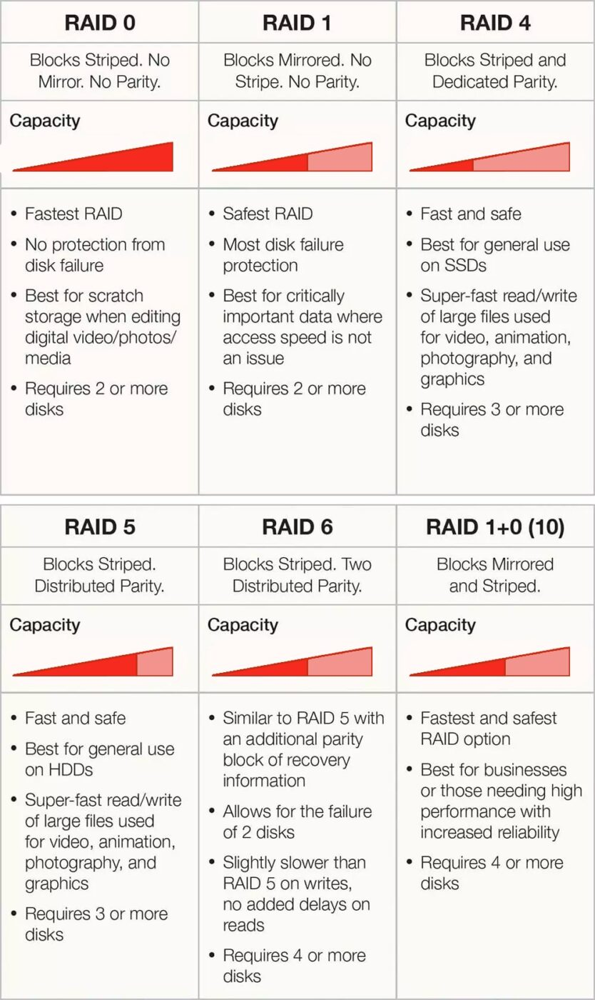
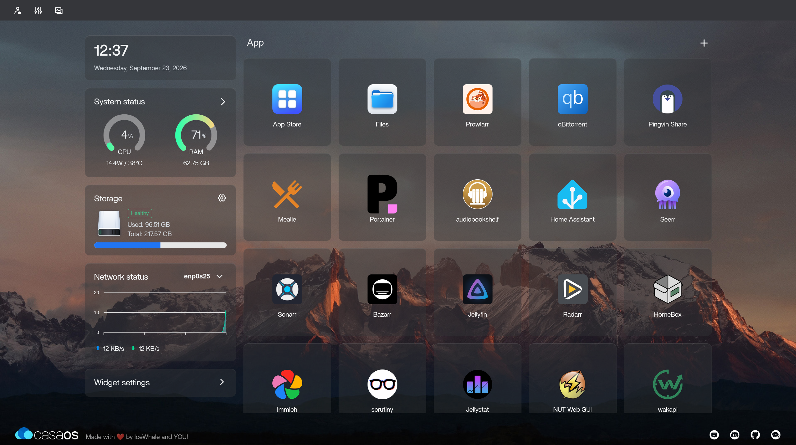
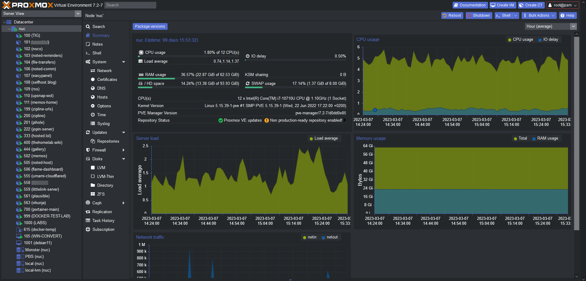
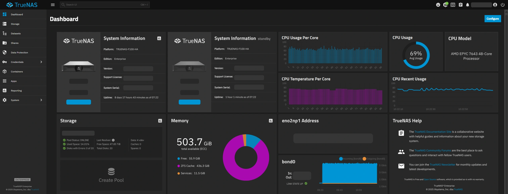
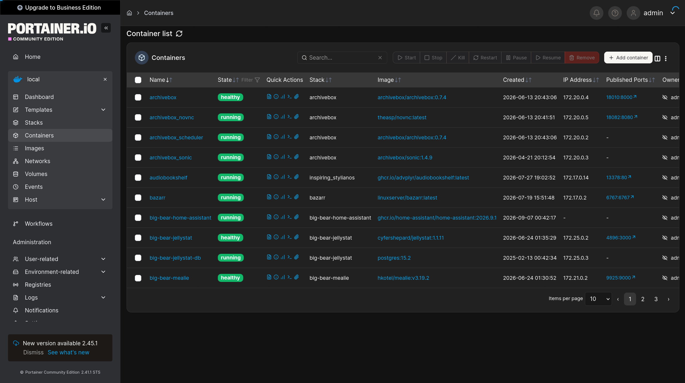

# Homelabbing: 2026 Edition

---

<!-- footer: "" -->

## What is homelabbing?

---

## Why would you want to self-host?

- Learn & Experiment
  - Security?
  - Networking?
- Privacy & Control
- Cost Savings (debatable)

---

<style scoped>
  li {
    font-size: 90%;
  }
</style>

## Great! But I don't have any hardware...

- This is slightly more difficult in the big '26
- Old desktops/laptops
  - Ebay
  - Goodwill
  - Facebook Marketplace - Massanutten Tech
- Cheap SBC
  - Raspberry Pi
  - OrangePi Zero 4
  - RockPro64
  - ODROID-H4
- VPS
- ESP-32 (ESPHome)

---

## Challenges of Homelabbing

- Security & Maintenance
  - Storage Redundancy
- Network Configuration
- Learning Curve - lots of new concepts

---

## RAID



---

## ZFS

- Similar modes to RAID - different names
- Auto-fixing corruption with checksums
- CoW - safer from power loss
- Instant snapshots
- Typically more performant (compression + caching)

---

## Services

- Immich <https://demo.immich.app>
- Wakapi
- Home Assistant
- Streaming
  - Jellyfin
  - Plex
  - \*arr suite
- Dawarich
- Game Servers

---

## Homelab Interfaces

- CasaOS
- Proxmox
- TrueNAS
- Portainer
- NixOS...

---



---



---



---



---

## NixOS

<!-- footer: "Slides by  Nicolas Cicchi - https://github.com/nmcicchi" -->

---

## Why NixOS for Homelabbing?

- Declarative Infrastructure: Entire OS & services configured in code, you can forget all your commands
- GitOps Ready: Keep your whole homelab state versioned in Git
- Fearless Experimentation: Try new software without polluting your host OS with nix-shell

---

## What Makes NixOS Better & Easier?

- Instant Rollbacks: Reboot into a working state in < 10 seconds if an update breaks
- Reproducible: Spin up a second server using the exact same config
- No Config Drift: What's in the config is what's running—nothing more, nothing less

---

<style scoped>
  pre {
    font-size: 50%;
  }
</style>

## Example nix module

```nix
{ fleetSettings, ... }: {
  virtualisation.oci-containers = {
    backend = "podman";
    containers = {

      # Original Hypermind
      hypermind = {
        image = "ghcr.io/lklynet/hypermind:latest";
        # use host networking for Hyperswarm DHT to find peers
        extraOptions = [ "--network=host" ];
        environment = {
          PORT = toString fleetSettings.sequoia.ports.hypermind;
          ENABLE_CHAT = "true";
          ENABLE_MAP = "true";
        };
      };

      # Hypermind Swarm
      hypermind-swarm = {
        image = "ghcr.io/lklynet/hypermind-swarm:latest";
        extraOptions = [ "--network=host" ];
        environment = {
          PORT = toString fleetSettings.sequoia.ports.hyperswarm;
        };
      };
    };
  };
}
```

---

<!-- footer: "" -->

## Exposing Your Services to the Internet

<!--reverse proxy (cloudflare, playit, oracle (wireguard), ) vs tailscale-->

- Tailscale
- Reverse Proxy

---

<!--footer: "¹: Jellyfin/Plex against ToS"-->

## Reverse Proxy Options

- Game Servers (Playit or Oracle)
- Web Services (Cloudflare Tunnel¹ or Oracle)
  - Cloudflare: Need Domain
  - Oracle: Can use domain, may need credit card to get access
    - More complex to set up (wireguard setup for web, manual NAT with iptables for game servers)
    - Need a tutorial to navigate the Oracle Cloud UI
    - Wireguard

---

<!--footer: ""-->

## How to get started

- Define your goals (what and why do you want to host?)
  - <https://github.com/awesome-selfhosted/awesome-selfhosted>
- Start with the hardware you have (or buy some very cheap, used hardware)
- Learn as you go (break things and learn to fix them)

---

## Questions?
