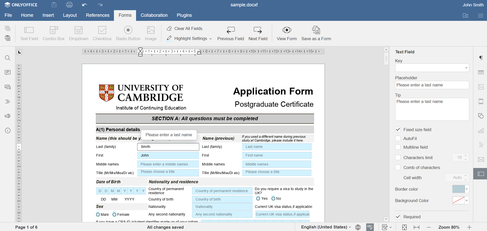
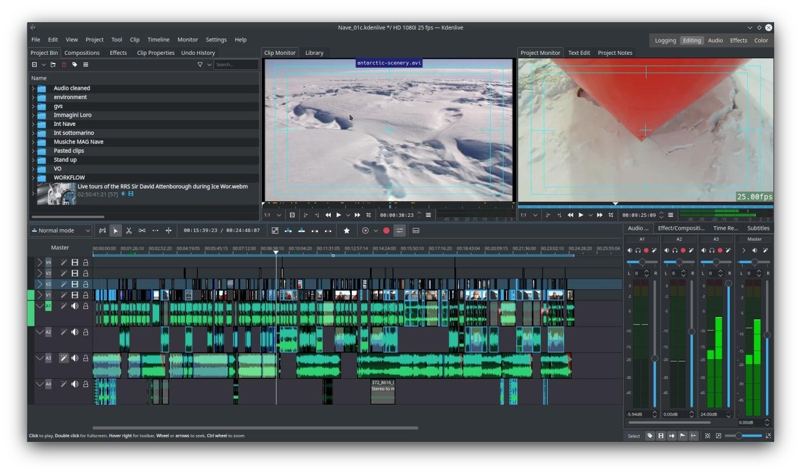
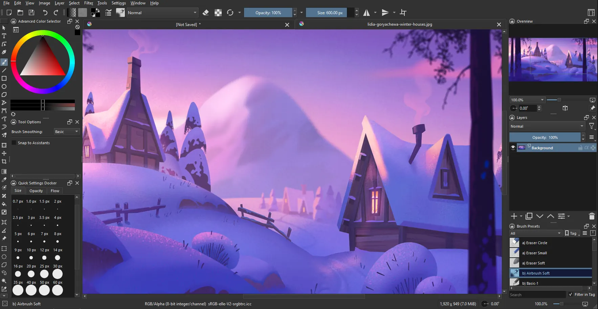
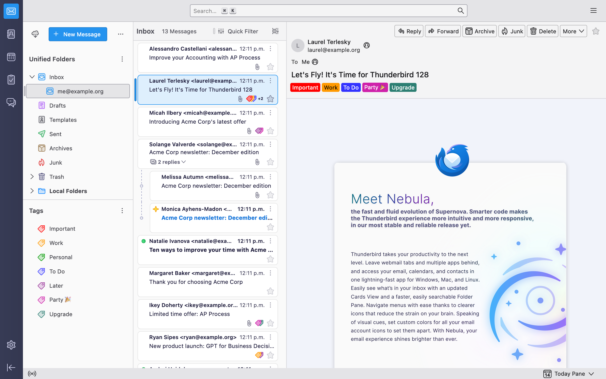

# Navigating Linux

## Software, gaming, configuration, and more

Connor Sample - <https://tabulate.tech>

---

# GNOME vs KDE

GNOME - <https://fedoraproject.org/workstation/>
KDE - <https://fedoraproject.org/spins/kde/>

---

# MAKE SURE TO MAKE A BACKUP

---

# Initial Setup (Fedora)

Excerpts from:
<https://github.com/jacksondarman/fedora-fresh-install/>

A much quicker way than doing this all manually:

```properties
sudo bash start.sh
```

---

# Improving DNF

```bash
sudoedit /etc/dnf/dnf.conf
```

```py
fastestmirror=True
max_parallel_downloads=10
defaultyes=True
```

---

# Installing RPM Fusion

```properties
sudo dnf install https://mirrors.rpmfusion.org/free/fedora/rpmfusion-free-release-$(rpm -E %fedora).noarch.rpm \
    https://mirrors.rpmfusion.org/nonfree/fedora/rpmfusion-nonfree-release-$(rpm -E %fedora).noarch.rpm
sudo dnf groupupdate core
```

---

# Installing Flathub

```properties
flatpak remote-add --if-not-exists flathub https://flathub.org/repo/flathub.flatpakrepo
```

---

# Setting your hostname

```properties
sudo hostnamectl set-hostname supercoolhostname
```

---

# Install Extra Media Codecs

```bash
sudo dnf swap ffmpeg-free ffmpeg --allowerasing
sudo dnf groupupdate multimedia --setop="install_weak_deps=False" --exclude=PackageKit-gstreamer-plugin
sudo dnf groupupdate sound-and-video
```

---

# Updating your system

```properties
sudo dnf upgrade
flatpak update
reboot
```

---

# Interesting Settings (KDE)

- Colors & Themes
- Display & Monitor
- Accessibility > Shake Cursor > Disable
- Power Management
- Software Update
- Users

---

# Flatpaks vs System Packages

- Flatpaks
  - Containerization
  - Sandboxing
  - Easy of Installation
- System Packages
  - Much smaller package sizes
  - Better system integration
  - May or may not encounter fewer issues

---

# Managing Software

1. Open "Discover" from the application menu.
2. Open "Settings" and look through the list of software.
3. If playing games on this system, search "Steam" and click the download button.
4. View installed software in the "Installed" tab.

---

# Setting up Steam to play Windows games

1. Launch Steam and sign in
2. In the upper left corner, press the "Steam" button and click "Settings"
3. Now, click "Compatibility"
4. Enable "Enable Steam Play for all other titles"

---

# Checking Steam Games Compatibility

<https://protondb.com>

Steam game options:

- Right click > Properties
  - General: Command Line Options
  - Compatibility: Force the use of a specific Steam Play compatibility tool

<https://github.com/TabulateJarl8/vapor>

---

# Some Software Alternatives

**These are also available on Windows!**

---

# Microsoft Office

- LibreOffice
- OnlyOffice (Non-OSS, shown to the right)
- Office Online



---

# Premiere Pro

- Kdenlive
- DaVinci Resolve (Non-OSS)




---

# Photoshop

- GIMP
- Krita

Bonus: <https://github.com/Diolinux/PhotoGIMP>



---

# Outlook

- Thunderbird



---

<!-- footer: "*  Available on Linux" -->

| Windows Software               | Alternative           |
| ------------------------------ | --------------------- |
| Epic Games Launcher/GOG/Amazon | Heroic Games Launcher |
| Illustrator                    | Inkscape              |
| Adobe Acrobat                  | Okular                |
| Official Minecraft Launcher\*  | Prism Launcher        |

---

<!-- footer: "" -->

# Useful Software

- Media Playback: VLC
- Video Recording/Streaming: OBS
- Audio Recording: Audacity
- Most essential package: fastfetch

---

# Questions?
