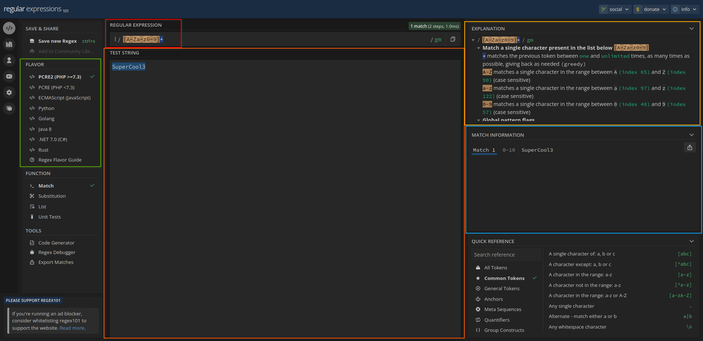
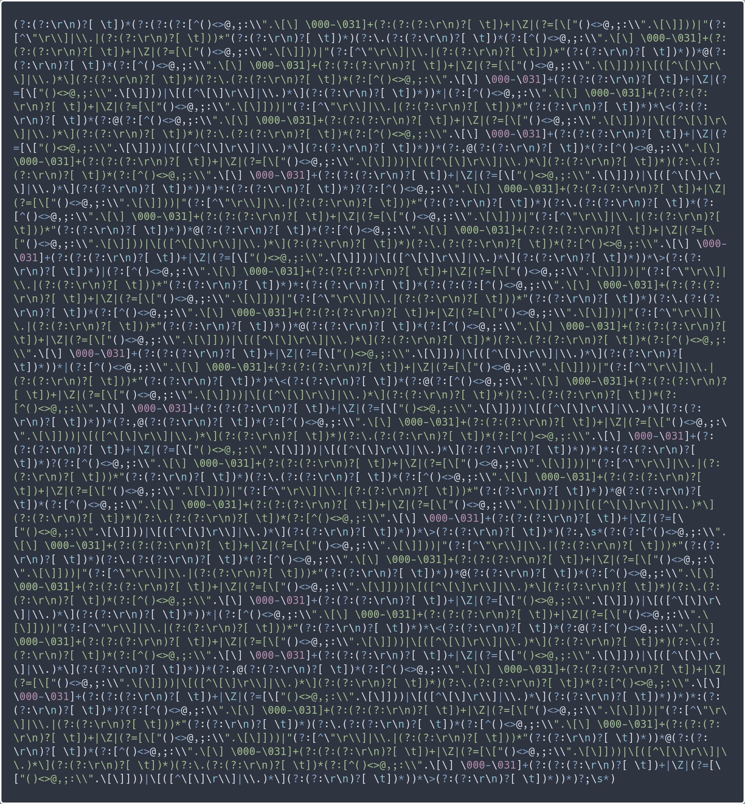
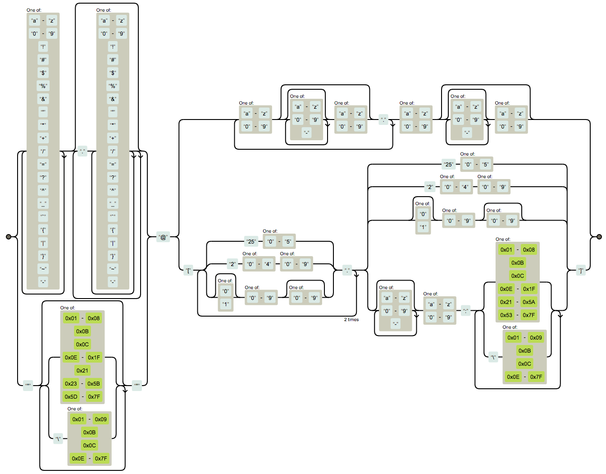

# Regular Expressions

Connor Sample - <https://tabulate.tech>

---

## <https://regex101.com>



---

## What are regular expressions?

- Sequences of characters that define a search pattern
- Pattern matching and manipulation of text

### Common use cases

- Searching for specific patterns in log files
- Parsing and extracting data from structured text
- Validating input in scripts and programs
- Utilies such as `grep`, `vim`, `sed`, and `awk` support regex

---

## Basic Syntax

- **Literal characters:** `/hello/`
- **Anchors:** Define positions within the text
  - `/^start/`
  - `/end$/`
- **Or:** Combine two predicates together with the OR operator
  - `/start|end/`

---

## Basic Syntax - Character classes

- `/[a-z]/`
- `/[A-Z0-9?]/`
- `/[^A-Z]/`
- The dot matches any character except line endings (`\n`, `\r`)
  - `/c.t/`
- Escape sequences can be used as shorthands
  - `\s`
  - `\d`
  - `\t`

---

## Basic Syntax - Quantifiers

- **Quantifiers:** Specify the number of occurrences
  - `/[0-9]{3}/`
  - `/[0-9]{3,5}/`
  - `/[A-Za-z]*/`
  - `/[A-Za-z]+/`
  - `/[a-z]?/`

---

## Escaping special characters

---

### Examples

1. **Finding patterns in files:**
   - Use `grep` to search for specific strings or patterns
   - `grep 'error' logfile.txt`
   - `grep -E '([0-9]{1,3}\.){3}[0-9]{1,3}' access.log`

2. **Replacing text in files:**
   - Use `sed` or `awk` to perform find and replace operations
   - `sed -i 's/\.html"/"/g' file.txt`

3. **Validating input:**
   - Ensure input adheres to specific formats or constraints
   - `<input type="text" pattern="[A-Za-z]{3}"`

---

## Advanced Techniques

- **Grouping and capturing:** Use parentheses to capture parts of a match
  - **Text:** "Name: John, Age: 50"
  - **Regex:** `Name: (\w+), Age: (\d+)`
  - Non-capturing groups can be created as such: `(?:\w+)`
- **Lookahead and lookbehind:** Specify conditions ahead or behind the match
  - **Text:** "apple, banana, pear"
  - **Regex:** `\w+(?=,)`
  - **Text:** "apple - banana - pear"
  - **Regex:** `(?<=-) \w+`

---

## Word Boundary Marker

- `\b` to match the position between word characters and non word characters
- Zero-width assertion
- "this is test" vs "this is testing"

---

## More Advanced Techniques

- **Backreferences:** Refer to captured groups
  - **Text:** "Ray loves Python so so much"
  - **Regex:** `(\b\w+\b) \1`

- **Greedy vs lazy matching:** Control the greediness of quantifiers with `?`
  - **Text:** `<div>Super</div> <p>Cool</p>`

---

### Example 1: Matching Digits

**Text:** "I have 3 apples and 5 oranges."

---

### Example 1: Solution

**Regex:** `\d+`

---

### Example 2: Matching Words with 3 characters

`\b` can be used to match "word-boundaries", which is the space around word
characters (`\w`).

**Text:** "The quick brown fox jumps over the lazy dog."

---

### Example 2: Solution

**Regex:** `\b\w{3}\b`

---

### Example 3: Matching Parts of a Date

Use capture groups to extract `March`, `5`, and `2024`.
**Text:** `March 5th, 2024`

---

### Example 3: Solution

**Regex:** `([A-Za-z]+)\s+(\d{1,2})(?:[A-Za-z]*),\s+(\d{4})`

---

### Example 4: Matching Email Addresses

**Text:** "Contact us at <payment@uugix.org>."

Simplified email specification:

- Any uppercase or lowercase letters; numbers; the following symbols: `._%+-`

Domain specification:

- Any letter (case insensitive), numbers, or the hyphen.
- Also support subdomains and TLDs of various lengths

Use `\b` to ensure the email is standalone

---

### Example 4: Solution

**Regex:** `\b[A-Za-z0-9._%+-]+@[A-Za-z0-9.-]+\.[A-Za-z]{2,}\b`

---

### Best practices

- Don't create an overconvoluted and undocumented mess
- Understand when you should and shouldn't use regex

---

[](https://pdw.ex-parrot.com/Mail-RFC822-Address.html)

---

```re
(?:[a-z0-9!#$%&'*+/=?^_`{|}~-]+(?:\.[a-z0-9!#$%&'*+/=?^_`{|}~-]+)*|"(?:
[\x01-\x08\x0b\x0c\x0e-\x1f\x21\x23-\x5b\x5d-\x7f]|\\
[\x01-\x09\x0b\x0c\x0e-\x7f])*")@(?:(?:[a-z0-9](?:[a-z0-9-]*[a-z0-9])?\.)
+[a-z0-9](?:[a-z0-9-]*[a-z0-9])?|\[(?:(?:(2(5[0-5]|[0-4][0-9])|1[0-9][0-9]|
[1-9]?[0-9]))\.){3}(?:(2(5[0-5]|[0-4][0-9])|1[0-9][0-9]|[1-9]?[0-9])|
[a-z0-9-]*[a-z0-9]:(?:[\x01-\x08\x0b\x0c\x0e-\x1f\x21-\x5a\x53-\x7f]|\\
[\x01-\x09\x0b\x0c\x0e-\x7f])+)\])
```

---



---

```py
import re

pattern = re.compile(r"""
\d+           # match one or more digits
\.            # match the `.` character
[A-Za-z]{5}   # match 5 letters of any case 
""", re.X)

pattern2 = re.compile(r"""
(?x)  # verbose mode
\d*   # match an optional digit
""")
```

---

## Q&A/Practice

- Extract the three parts of a phone number with capturing groups
- Parse dash-delimited dates (`2024-03-21`)
- Write a regex to match URLs
- Extract the parts of markdown links
  - `[Display Text](https://tabulate.tech)`
- Extract the arguments from a Python function signature:
  - `def func(arg1, arg2):`
