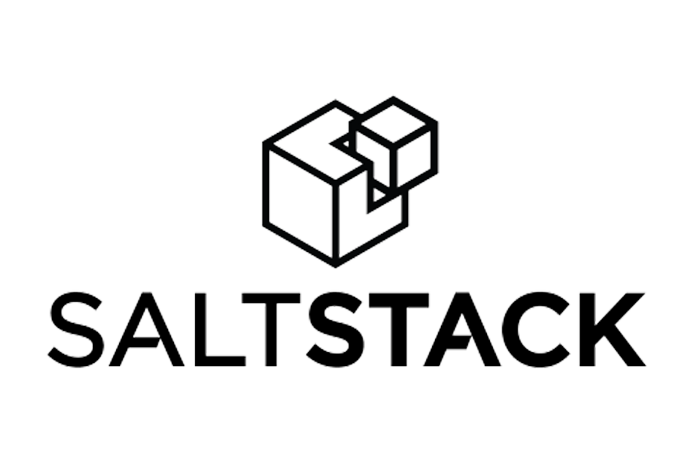
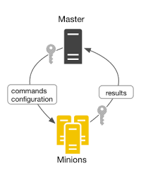

---
class:
  - lead
  - gaia
paginate: true
marp: true
backgroundImage: 'url(''https://marp.app/assets/hero-background.jpg'')'
---



--------------------------------------------------------------------------------

# What is Configuration mangement?

- Configuration mangement is the practace of centrally managing and configuring systems from a centralized control point. Configuration management tools are used for remote configuration of systems (Windows or Linux) in an environment.

--------------------------------------------------------------------------------

# Configration Management tools

- Ansible

- Puppet

- Chef

- SaltStack

--------------------------------------------------------------------------------

# About Salt

- Started in 2011 by Thomas Hatch

- Python based, and open source

- Uses the YAML data structure along with JINJA templating

- It has a large open source community

- It uses a client-server model, allowing for remote command execution

- Easily scalable, supporting thousands of nodes

- Uses message queue networking

- Highly modular

--------------------------------------------------------------------------------

# Architecture

- Client-server model

  - Master (server)
  - Minion (client)

- Uses the asynchronous message library ZeroMQ for message queuing

- Communication encrypted over SSH



--------------------------------------------------------------------------------

# Pillars and Grains

- Pillars

  - User defined variables that are stored on the minion

    - Also able to be stored on a git server

- Grains

  - Static information, such as OS version, about a device (minion)

--------------------------------------------------------------------------------

# Execution Modules

- Add hoc commands on the command line targeting one or more minions


--------------------------------------------------------------------------------

# States

- Each salt state is contained in an Salt State File (SLS)

- These state files are written in YAML, and can also contain JINJA templates

```yaml
network_utilities:
  pkg.installed:
    - pkgs:
      - rsync
      - curl

nginx_pkg:
  pkg.installed:
    - name: nginx

nginx_service:
  service.running:
    - name: nginx
    - enable: True
    - require:
      - pkg: nginx_pkg
```

--------------------------------------------------------------------------------

# Top File

- There are two top files that exist

  1. The states top file maps the machines and the states that should be applied to them
  2. The pillars top file maps the machines and the pillar data that they can access

```yaml
base:
    # Applied to all servers
    '*':
        - universal_setp
    # Applied only to ubuntu servers
    'os:Ubuntu':
        - match: grain
        - ubuntu_setup
    # Applied only to web-server
    web-server:
        - apache_setup
```

--------------------------------------------------------------------------------

# Targeting Minions

- We can target minions using a list, regex, grains, or node groups

```bash
salt minion1 test.ping
salt "minion*" test.ping
salt -L "minion1, minion2" test.ping
Salt -G 'os_family:windows' test.ping
salt -N windows_minions test.ping
```

- node groups, configured in master configuration (/etc/salt/master)

```yaml
nodegroups:
    windows_minions 'G@os_family:windows'
```

--------------------------------------------------------------------------------

# Event System

- uses publisher/subscribe model for publishing events

- Events are published onto the event bus and event bus subscribers listen for the published events.

```bash
# Watch the event bus forever in a shell while-loop.
salt-run state.event | while read -r tag data; do
    echo $tag
    echo $data | jq --color-output .
done
```

--------------------------------------------------------------------------------

# Reactor

- Allows for taking actions related to events by watching the event bus for event tags that match a given pattern and then running one or more commands in response

--------------------------------------------------------------------------------

# Salt Installation (Ubuntu Example)

<!-- markdownlint-disable MD029 -->
1. Run the following command to import the SaltStack repository key:

  ```bash
  wget -O - <https://repo.saltstack.com/apt/ubuntu/18.04/amd64/latest/SALTSTACK-GPG-KEY.pub> | sudo apt-key add -
  ```

2. Save the following file to /etc/apt/sources.list.d/saltstack.list:

  ```bash
  deb http://repo.saltstack.com/apt/ubuntu/18.04/amd64/latest bionic main
  ```

3. Run sudo apt-get update

4. Install the salt-minion, salt-master, or other Salt components:

  ```bash
  sudo apt-get install salt-master
  sudo apt-get install salt-minion
  ```
<!-- markdownlint-enable MD029 -->

Once installed all Salt components are controlled through systemd unit files

--------------------------------------------------------------------------------

# Salt master Configuration

- location:

  - /etc/salt/master (default)
  - /etc/salt/master.d/*.conf (atomic configuration files)

- contains:

  - File server settings (i.e. git configuration)
  - nodegroups
  - mysql connection
  - reactor states

--------------------------------------------------------------------------------

# Salt Minion Configuration

- location:

  - /etc/salt/minion

- contains

  - master location value
  - logging level
