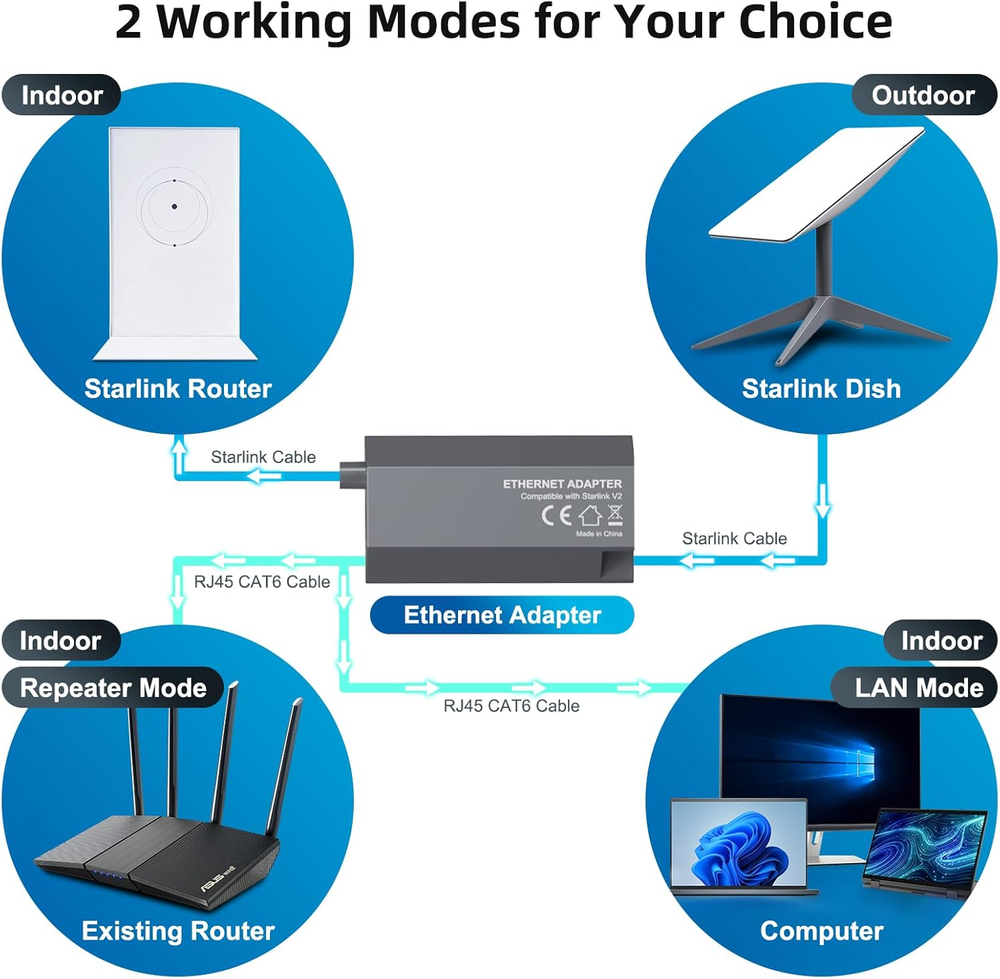
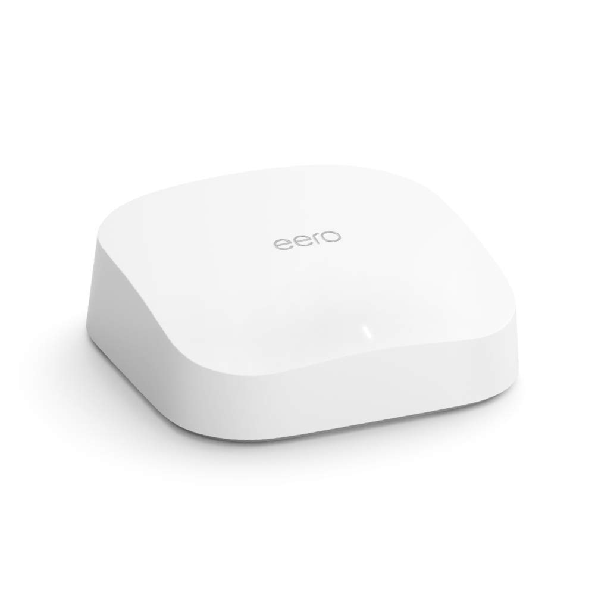
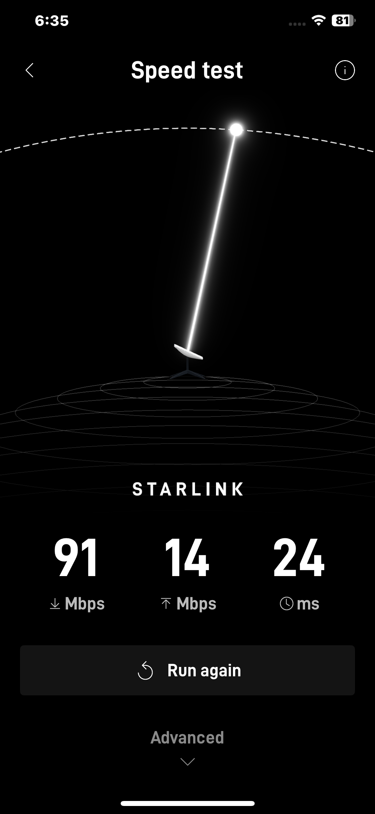

# Lessons and Takeaways from Setting up a Starlink in the Woods

Mitch Feigenbaum - <https://mitchf.me>

---

# Background

- I was tasked by my boss with setting up a Starlink at his cabin in the middle of the Shenendoah valley.
- For reference, it's on a mountain in the middle of nowhere

---

---

# Requirements

1. **Connect to the Internet**
2. Set up a guest network and a private security camera network
3. Make it secure
4. Allow for remote access to the security cameras

---

# Initial Challenges

1. Starlink router is very limited
	a. No guest network capability
	b. No ethernet adapter
2. Trees block the view (especially in the Spring)

---

# Dealing with the limited Starlink router

1. Use a third party ethernet to micro usb-c adapter between the router and the dish
2. Use a third party router (EERO Pro 6) to allow guest network functionality

---

---

---

# Dealing with the trees

1. Used a mount on the side of the house to get a better view
2. Still 3% obstacle obstruction (as calculated on app), causes intermittent outages

---

# Now the fun part

- Starlink requires a subscription to start using it

## Good news

- Starlink allows you to access the Starlink website during the setup to buy a subscription

## Bad news

- Starlink accounts send you email verification on login, but gmail is blocked on the Starlink network

---

# How we solved it

### Not easily

---

# A note on the Starlink Subscription

- If you set up your account as a business, you won't even be shown the home option
- The home option is advertised as $80 a month
- Suprise!!! It's actually $120 a month plus a $100 one time "congestion charge"

---

# Starlink account database speculation

- Once the payment was sent, it said it auto created an account with the email used.
- It auto redirected to the existing account associated with the email, but the account had no subscription on it
- The internet worked after this
- Speculation: the Starlink account database is severely buggy (not too far off considering its owner's other ventures [see X])

---

# Setting up the cameras

1. Used cobra cameras connected to the EERO router with a 100 foot ethernet cable
2. Connected the EERO router to the Starlink router via the adapter

---

# Yet Another Issue

1. The EERO router has an easy mobile interface that allows you to change settings
2. The EERO router has support for UPNP, which the cameras use to connect externally
3. The Starlink Router is unable to be configured until it downloads an update, which automatically happpens... at 3am
4. This can be mitigated by using the Starlink router in bypass mode... which requires the router configuration... which is unavailable until the update is installed

---

# Final Configuration

- Our network topology consists of the Starlink dish
- Which sends its signal to the Starlink router
- Which sends its signal to the Ethernet adapter
- Which sends its signal to the EERO router
- Which sends its signal via ethernet to the security cameras and via wifi to the guest network

---

# Takeaways

1. Everything takes more time on the mountain
2. Starlink needs to think about its actual use case
3. It all sort of works, impressively (90 mbps down, 15 mbps up)

---

