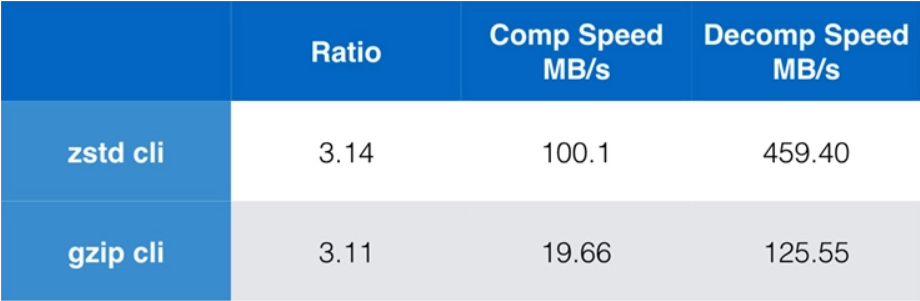
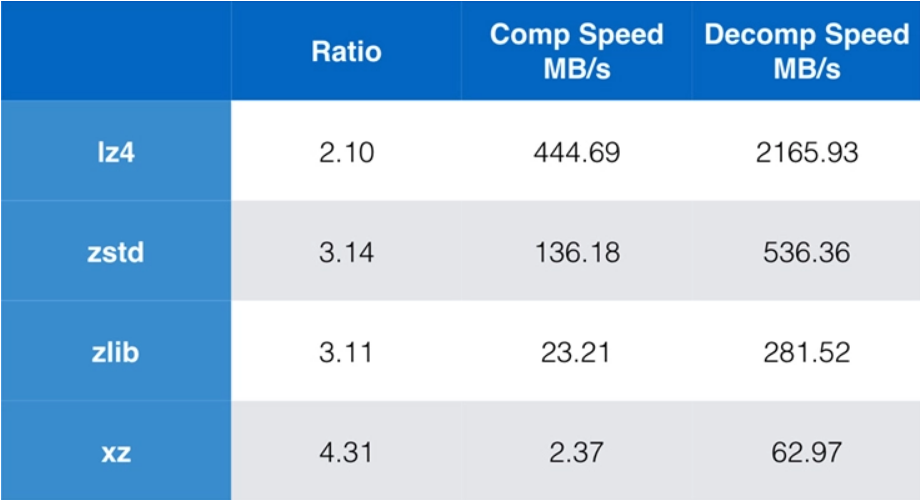
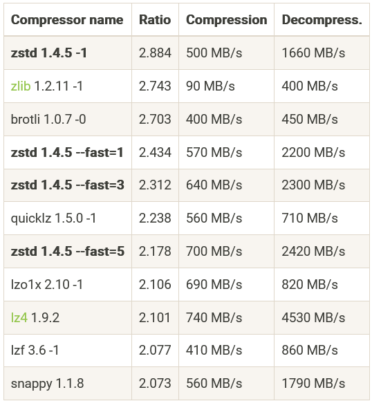

# Zstandard

The bestest compression ever

---
# Why Compress?

- Redundant data happens everywhere
- CPU time is often more plentiful than I/O bandwidth, especially with networks
- A little compute time up front can save huge long-term storage costs

---
# Popular utilities

- DEFLATE - LZ77 + Huffman
  - zip
  - gzip
  - zstd
- Burrows–Wheeler transform
  - bzip2
- LZMA - Lempel–Ziv–Markov chain algorithm
  - xz

---
# Why zstd?

- Permissive BSD license allows it to be incorporated in many projects
- Optimized for modern hardware
- Built for multi-threading
- Very configurable time vs space

---
# Unique zstd features

- Adaptive compression ratio
- Trainable dictionary
- Optional very long search window
- Rapid integration into many projects
  - Kernel, file systems, databases, package managers

---
# Some benchmarks

<https://engineering.fb.com/2016/08/31/core-data/smaller-and-faster-data-compression-with-zstandard/>

---
# More benchmark

<https://engineering.fb.com/2016/08/31/core-data/smaller-and-faster-data-compression-with-zstandard/>

---
# One more for good luck

<http://facebook.github.io/zstd/>
